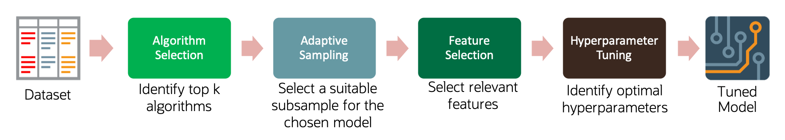
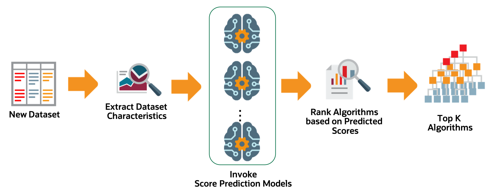
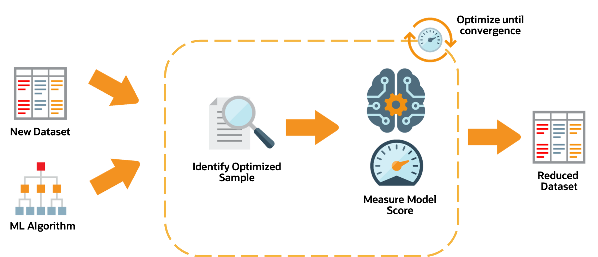
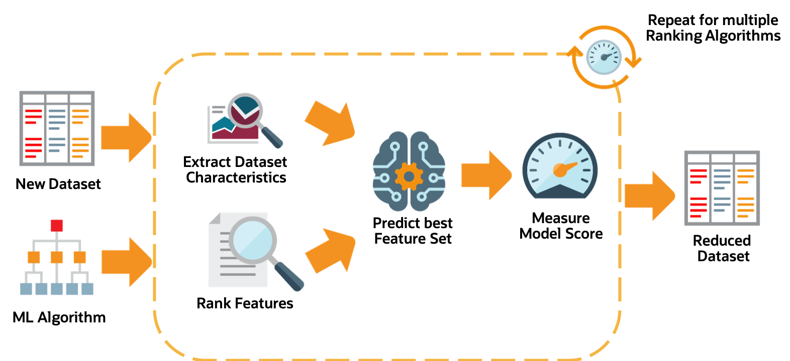
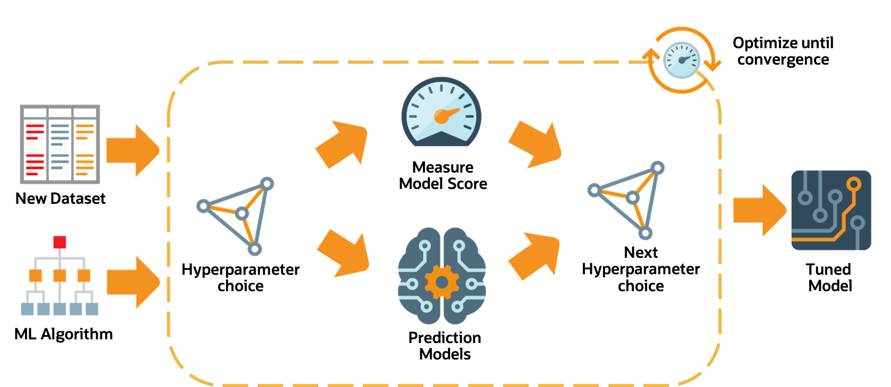

The Oracle AutoML Pipeline
==========================

An AutoML Pipeline consists of these four main stages:

The stages operate in sequence: 
 
.. contents::

Algorithm Selection
-------------------

With a given dataset and a prediction task, the goal is to identify the algorithm that maximizes the model score. This best algorithm is not always intuitive and simply picking a complex model is suboptimal for many use cases. The ADS algorithm selection stage is designed to rank algorithms based on their estimated predictive performance on the given dataset. 

For a given dataset, the algorithm selection process is as follows:

#. Extract relevant dataset characteristics, such as dataset shape, feature correlations, and appropriate meta-features.
#. Invoke specialized score-prediction metamodels that were learned to predict algorithm performance across a wide variety of datasets and domains.
#. Rank algorithms based on their predicted performance.
#. Select the optimal algorithm.

Adaptive Sampling
-----------------

Adaptive sampling iteratively subsamples the dataset and evaluates each sample to obtain a score for a specific algorithm.  The goal is to find the smallest sample size that adequately represents the full dataset. It is used in subsequent pipeline stages without sacrificing the quality of the model.

The adaptive sampling process is as follows:

#. For a given algorithm and dataset, identify a representative sample.
#. Leverage meta-learning to predict algorithm performance on the given sample.
#. Iterate until the score converges.
#. The identified sample is then used for subsequent stages of the AutoML Pipeline.

Feature Selection
-----------------

The feature selection stage aims to select a subset of features that are highly predictive of the target. This speeds up model training without loss of predictive performance.  The ADS feature selection approach leverages meta-learning to intelligently identify the optimal feature subset for a given algorithm and dataset. The high level process is: 

For a given dataset, the feature selection process is as follows:

#. Obtain the dataset meta-features, similar to those obtained in the algorithm selection stage.
#. Rank all features using multiple ranking algorithms. Feature rankings are ordered lists of features from most to least important.
#. For each feature ranking, the optimal feature subset is identified.
#. Algorithm performance is predicted by leveraging meta-learning on a given feature subset.
#. Iterating over multiple feature subsets, the optimal subset is determined.

Hyperparameter Tuning
---------------------

The hyperparameter tuning stage determines the optimal values for the model's hyperparameters. Generally, tuning is the most time-consuming stage of an AutoML pipeline. Therefore, the hyperparameter tuning process is designed with efficiency and scalability as first-order requirements. The ADS tuning strategy is summarized as: 

