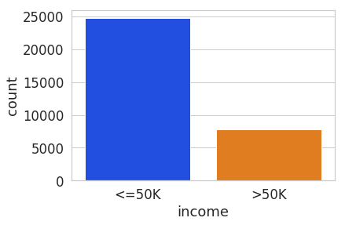
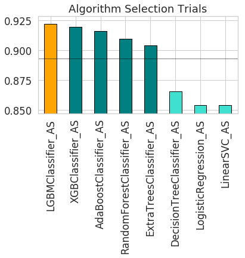
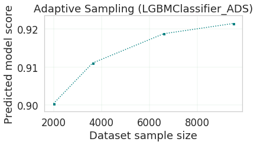
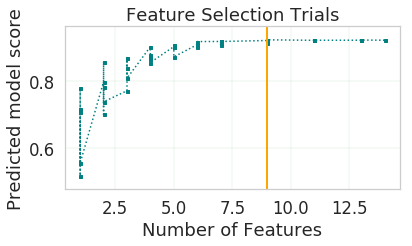
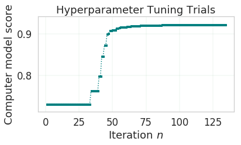
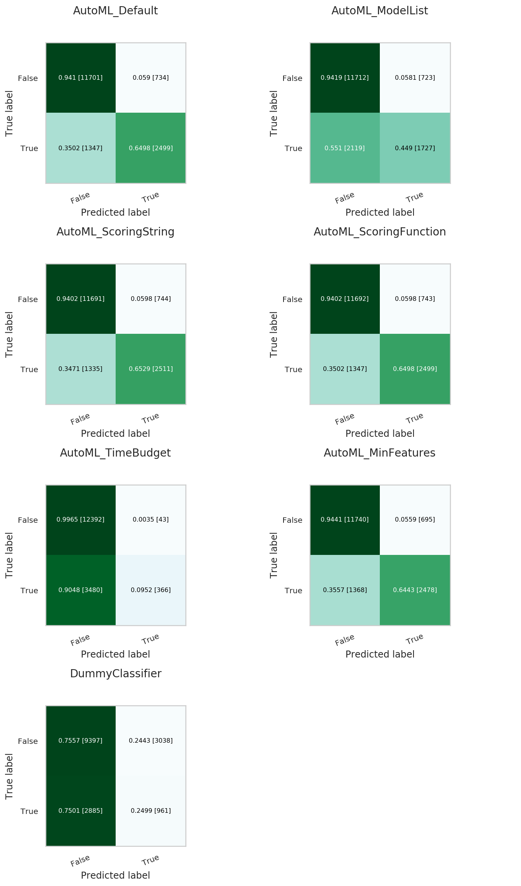

Using ``OracleAutoMLProvider``
******************************

To demonstrate the ``OracleAutoMLProvider`` API, this example builds a classifier using the ``OracleAutoMLProvider`` tool for the public Census Income dataset. The dataset is a binary classification dataset and more details about the dataset are found at https://archive.ics.uci.edu/ml/datasets/Adult.  Various options provided by the Oracle AutoML tool are explored allowing you to exercise control over the AutoML training process. The different models trained by Oracle AutoML are then evaluated.

Setup
=====

Load the necessary modules:

.. code:: python3

    import seaborn as sns
    import pickle
    import pandas as pd
    import matplotlib.pyplot as plt
    import logging
    import gzip

    from ads.evaluations.evaluator import ADSEvaluator
    from ads.dataset.factory import DatasetFactory
    from ads.automl.provider import OracleAutoMLProvider
    from ads.automl.driver import AutoML

    plt.rcParams['figure.figsize'] = [10, 7]
    plt.rcParams['font.size'] = 15
    sns.set(color_codes=True)
    sns.set(font_scale=1.5)
    sns.set_palette("bright")
    sns.set_style("whitegrid")

Dataset
=======

Start by reading in the dataset from UCI. The dataset is not properly formatted, the separators have spaces between them, and the test set has a corrupt row at the top. These options are specified to the Pandas CSV reader. The dataset has already been pre-split into training and test sets. The training set is used to create a machine learning model using Oracle AutoML, and the test set is used to evaluate the model’s performance on unseen data.

.. code:: python3

    column_names = [
        'age',
        'workclass',
        'fnlwgt',
        'education',
        'education-num',
        'marital-status',
        'occupation',
        'relationship',
        'race',
        'sex',
        'capital-gain',
        'capital-loss',
        'hours-per-week',
        'native-country',
        'income',
    ]

    df = pd.read_csv('http://archive.ics.uci.edu/ml/machine-learning-databases/adult/adult.data',
                     names=column_names, sep=',\s*', na_values='?')
    test_df = pd.read_csv('http://archive.ics.uci.edu/ml/machine-learning-databases/adult/adult.test',
                          names=column_names, sep=',\s*', na_values='?', skiprows=1)

Retrieve some of the values in the data:

.. code:: python3

    df.head()

.. csv-table:: Adult
   :header-rows: 1

   **age**,**workclass**,**fnlwgt**,**education**,**education-num**,**marital-status**,**occupation**,**relationship**,**race**,**sex**,**capital-gain**,**capital-loss**,**hours-per-week**,**native-country**,**income_level**
  39,State-gov,77516,Bachelors,13,Never-married,Adm-clerical,Not-in-family,White,Male,2174,0,40,United-States,<=50K
  50,Self-emp-not-inc,83311,Bachelors,13,Married-civ-spouse,Exec-managerial,Husband,White,Male,0,0,13,United-States,<=50K
  38,Private,215646,HS-grad,9,Divorced,Handlers-cleaners,Not-in-family,White,Male,0,0,40,United-States,<=50K
  53,Private,234721,11th,7,Married-civ-spouse,Handlers-cleaners,Husband,Black,Male,0,0,40,United-States,<=50K
  28,Private,338409,Bachelors,13,Married-civ-spouse,Prof-specialty,Wife,Black,Female,0,0,40,Cuba,<=50K
  37,Private,284582,Masters,14,Married-civ-spouse,Exec-managerial,Wife,White,Female,0,0,40,United-States,<=50K

The Adult dataset contains a mix of numerical and string data, making it a challenging problem to train machine learning models on.

.. code:: python3

    pd.DataFrame({'Data type': df.dtypes}).T

.. csv-table:: Adult Data Types
   :header-rows: 1

   **age**,**workclass**,**fnlwgt**,**education**,**education-num**,**marital-status**,**occupation**,**relationship**,**race**,**sex**,**capital-gain**,**capital-loss**,**hours-per-week**,**native-country**,**income_level**
   int64,object,int64,object,int64,object,object,object,object,object,int64,int64,int64,object,object

The dataset is also missing many values, further adding to its complexity. The Oracle AutoML solution automatically handles missing
values by intelligently dropping features with too many missing values, and filling in the remaining missing values based on the feature type.

.. code:: python3

    pd.DataFrame({'% missing values': df.isnull().sum() * 100 / len(df)}).T

.. csv-table:: Adult Data Types
   :header-rows: 1

   ,**age**,**workclass**,**fnlwgt**,**education**,**education-num**,**marital-status**,**occupation**,**relationship**,**race**,**sex**,**capital-gain**,**capital-loss**,**hours-per-week**,**native-country**,**income_level**
   % missing values,0.0,5.638647,0.0,0.0,0.0,0.0,5.660146,0.0,0.0,0.0,0.0,0.0,0.0,0.0,0.0

Visualize the distribution of the target variable in the training data.

.. code:: python3

    target_col = 'income'
    sns.countplot(x="income", data=df)

The test set has a different set of labels from the training set. The test set labels have an extra period (.) at the end causing incorrect scoring.

.. code:: python3

    print(df[target_col].unique())
    print(test_df[target_col].unique())

.. parsed-literal::

    ['<=50K' '>50K']
    ['<=50K.' '>50K.']

Remove the trailing period (.) from the test set labels.

.. code:: python3

    test_df[target_col] = test_df[target_col].str.rstrip('.')
    print(test_df[target_col].unique())

.. parsed-literal::

    ['<=50K' '>50K']

Convert the Pandas dataframes to ``ADSDataset`` to use with ADS APIs.

.. code:: python3

    train = DatasetFactory.open(df).set_target(target_col)
    test = DatasetFactory.open(test_df).set_target(target_col)

If the data is not already pre-split into train and test sets, you can split it with the ``train_test_split()`` or ``train_validation_test_split()`` method. This example of loading the data and splitting it into an 80%/20% train and test set.

.. code:: python3

    ds = DatasetFactory.open("path/data.csv").set_target('target')
    train, test = ds.train_test_split(test_size=0.2)

Splitting the data into train, validation, and test returns three data subsets. If you don't specify the test and validation sizes, the data is split 80%/10%/10%. This example assigns a 70%/15%/15% split:

.. code:: python3

    data_split = ds.train_validation_test_split(
        test_size=0.15,
        validation_size=0.15
    )
    train, validation, test = data_split
    print(data_split)   # print out shape of train, validation, test sets in split

``OracleAutoMLProvider``
========================

The Oracle AutoML solution automatically provides a tuned machine learning pipeline that best models the given a training dataset and prediction task at hand. The dataset can be any supervised prediction task. For example, classification or regression where the target can be a simple binary or a multinomial value or a real valued column in a table, respectively.

The Oracle AutoML solution is selected using the ``OracleAutoMLProvider`` object that delegates model training to the AutoML package.

AutoML consists four main modules:

#. **Algorithm Selection** - Identify the right algorithm for a given dataset, choosing from:

   * AdaBoostClassifier
   * DecisionTreeClassifier
   * ExtraTreesClassifier
   * KNeighborsClassifier
   * LGBMClassifier
   * LinearSVC
   * LogisticRegression
   * RandomForestClassifier
   * SVC
   * XGBClassifier

#. **Adaptive Sampling** - Choose the right subset of samples for evaluation while trying to balance classes at the same time.
#. **Feature Selection** - Choose the right set of features that maximize score for the chosen algorithm.
#. **Hyperparameter Tuning** - Find the right model parameters that maximize score for the given dataset.

All these modules are readily combined into a simple AutoML pipeline that automates the entire machine learning process with minimal user input and interaction. The ``OracleAutoMLProvider`` class supports two arguments:

#. **n_jobs**: Specifies the degree of parallelism for Oracle AutoML. -1 (the default) means that AutoML uses all available cores.
#. **loglevel**: The verbosity of output for Oracle AutoML. Can be specified using the Python `logging module <https://docs.python.org/3/library/logging.html#logging-levels>`_.

Create an ``OracleAutoMLProvider`` object that uses all available cores and disable any logging.

.. code:: python3

    ml_engine = OracleAutoMLProvider(n_jobs=-1, loglevel=logging.ERROR)

Train 
=====

The AutoML API is quite simple to work with. Create an instance of Oracle AutoML (``oracle_automl``). Then the training data is passed to the ``fit()`` function that does the following:

#. Preprocesses the training data.
#. Identifies the best algorithm.
#. Identifies the best set of features.
#. Identifies the best set of hyperparameters for this data.

A model is then generated that can be used for prediction tasks. ADS uses the ``roc_auc`` scoring metric to evaluate the performance of this model on unseen data (``X_test``).

.. code:: python3

    oracle_automl = AutoML(train, provider=ml_engine)
    automl_model1, baseline = oracle_automl.train()

.. raw:: html

     

    

        

            <h2>AUTOML</h2>
        

        
AutoML Training (OracleAutoMLProvider)...

    

.. raw:: html

    

        
Training complete (66.81 seconds)

    

.. raw:: html

    <table border="1" class="dataframe">
      <tbody>
        <tr>
          <td>Training Dataset size</td>
          <td>(32561, 14)</td>
        </tr>
        <tr>
          <td>Validation Dataset size</td>
          <td>None</td>
        </tr>
        <tr>
          <td>CV</td>
          <td>5</td>
        </tr>
        <tr>
          <td>Target variable</td>
          <td>income</td>
        </tr>
        <tr>
          <td>Optimization Metric</td>
          <td>roc_auc</td>
        </tr>
        <tr>
          <td>Initial number of Features</td>
          <td>14</td>
        </tr>
        <tr>
          <td>Selected number of Features</td>
          <td>9</td>
        </tr>
        <tr>
          <td>Selected Features</td>
          <td>[age, workclass, education, education-num, occupation, relationship, capital-gain, capital-loss, hours-per-week]</td>
        </tr>
        <tr>
          <td>Selected Algorithm</td>
          <td>LGBMClassifier</td>
        </tr>
        <tr>
          <td>End-to-end Elapsed Time (seconds)</td>
          <td>66.81</td>
        </tr>
        <tr>
          <td>Selected Hyperparameters</td>
          <td>{'boosting_type': 'gbdt', 'class_weight': None, 'learning_rate': 0.1, 'max_depth': 8, 'min_child_weight': 0.001, 'n_estimators': 100, 'num_leaves': 31, 'reg_alpha': 0, 'reg_lambda': 0}</td>
        </tr>
        <tr>
          <td>Mean Validation Score</td>
          <td>0.923</td>
        </tr>
        <tr>
          <td>AutoML n_jobs</td>
          <td>64</td>
        </tr>
        <tr>
          <td>AutoML version</td>
          <td>0.3.1</td>
        </tr>
      </tbody>
    </table>

.. csv-table:: Adult
   :header-rows: 1

  Rank based on Performance,Algorithm,#Samples,#Features,Mean Validation Score,Hyperparameters,CPU Time
  2,LGBMClassifier_HT,32561,9,0.9230,"{'boosting_type': 'gbdt', 'class_weight': 'balanced', 'learning_rate': 0.1, 'max_depth': 8, 'min_child_weight': 0.001, 'n_estimators': 100, 'num_leaves': 31, 'reg_alpha': 0, 'reg_lambda': 0}",5.7064
  3,LGBMClassifier_HT,32561,9,0.9230,"{'boosting_type': 'gbdt', 'class_weight': None, 'learning_rate': 0.1, 'max_depth': 8, 'min_child_weight': 0.0012000000000000001, 'n_estimators': 100, 'num_leaves': 31, 'reg_alpha': 0, 'reg_lambda': 0}",4.0975
  4,LGBMClassifier_HT,32561,9,0.9230,"{'boosting_type': 'gbdt', 'class_weight': None, 'learning_rate': 0.1, 'max_depth': 8, 'min_child_weight': 0.0011979297617518694, 'n_estimators': 100, 'num_leaves': 31, 'reg_alpha': 0, 'reg_lambda': 0}",3.1736
  5,LGBMClassifier_HT,32561,9,0.9227,"{'boosting_type': 'gbdt', 'class_weight': None, 'learning_rate': 0.1, 'max_depth': 8, 'min_child_weight': 0.001, 'n_estimators': 127, 'num_leaves': 31, 'reg_alpha': 0, 'reg_lambda': 0}",5.9078
  6,LGBMClassifier_HT,32561,9,0.9227,"{'boosting_type': 'gbdt', 'class_weight': None, 'learning_rate': 0.1, 'max_depth': 8, 'min_child_weight': 0.001, 'n_estimators': 100, 'num_leaves': 32, 'reg_alpha': 0, 'reg_lambda': 0}",3.9490
  ...,...,...,...,...,...,...
  188,LGBMClassifier_FRanking_FS,32561,1,0.7172,"{'boosting_type': 'gbdt', 'learning_rate': 0.1, 'max_depth': -1, 'min_child_weight': 0.001, 'n_estimators': 100, 'num_leaves': 31, 'reg_alpha': 0, 'reg_lambda': 1, 'class_weight': 'balanced'}",1.5153
  189,LGBMClassifier_AVGRanking_FS,32561,1,0.7081,"{'boosting_type': 'gbdt', 'learning_rate': 0.1, 'max_depth': -1, 'min_child_weight': 0.001, 'n_estimators': 100, 'num_leaves': 31, 'reg_alpha': 0, 'reg_lambda': 1, 'class_weight': 'balanced'}",1.5611
  190,LGBMClassifier_RFRanking_FS,32561,2,0.7010,"{'boosting_type': 'gbdt', 'learning_rate': 0.1, 'max_depth': -1, 'min_child_weight': 0.001, 'n_estimators': 100, 'num_leaves': 31, 'reg_alpha': 0, 'reg_lambda': 1, 'class_weight': 'balanced'}",2.9917
  191,LGBMClassifier_AdaBoostRanking_FS,32561,1,0.5567,"{'boosting_type': 'gbdt', 'learning_rate': 0.1, 'max_depth': -1, 'min_child_weight': 0.001, 'n_estimators': 100, 'num_leaves': 31, 'reg_alpha': 0, 'reg_lambda': 1, 'class_weight': 'balanced'}",1.7886
  192,LGBMClassifier_RFRanking_FS,32561,1,0.5190,"{'boosting_type': 'gbdt', 'learning_rate': 0.1, 'max_depth': -1, 'min_child_weight': 0.001, 'n_estimators': 100, 'num_leaves': 31, 'reg_alpha': 0, 'reg_lambda': 1, 'class_weight': 'balanced'}",2.0109

During the Oracle AutoML process, a summary of the optimization process is printed:

#. Information about the training data.
#. Information about the AutoML Pipeline. For example,the selected features that AutoML found to be most predictive in the training data, the selected algorithm that was the best choice for this data, and the model hyperparameters for the selected algorithm.
#. A summary of the different trials that AutoML performs in order to identify the best model.

The Oracle AutoML Pipeline automates much of the data science process, trying out many different machine learning parameters quickly in a parallel fashion. The model provides a ``print_trials`` API to output 
all the different trials performed by Oracle AutoML. The API has two arguments:

#. **max_rows**: Specifies the total number of trials that are printed. By default, all trials are printed.
#. **sort_column**: Column to sort results by. Must be one of:

   * Algorithm
   * #Samples
   * #Features
   * Mean Validation Score
   * Hyperparameters
   * CPU Time

.. code:: python3

    oracle_automl.print_trials(max_rows=20, sort_column='Mean Validation Score')

.. csv-table::
   :header-rows: 1

  Rank based on Performance,Algorithm,#Samples,#Features,Mean Validation Score,Hyperparameters,CPU Time
  2,LGBMClassifier_HT,32561,9,0.9230,"{'boosting_type': 'gbdt', 'class_weight': 'balanced', 'learning_rate': 0.1, 'max_depth': 8, 'min_child_weight': 0.001, 'n_estimators': 100, 'num_leaves': 31, 'reg_alpha': 0, 'reg_lambda': 0}",5.7064
  3,LGBMClassifier_HT,32561,9,0.9230,"{'boosting_type': 'gbdt', 'class_weight': None, 'learning_rate': 0.1, 'max_depth': 8, 'min_child_weight': 0.0012000000000000001, 'n_estimators': 100, 'num_leaves': 31, 'reg_alpha': 0, 'reg_lambda': 0}",4.0975
  4,LGBMClassifier_HT,32561,9,0.9230,"{'boosting_type': 'gbdt', 'class_weight': None, 'learning_rate': 0.1, 'max_depth': 8, 'min_child_weight': 0.0011979297617518694, 'n_estimators': 100, 'num_leaves': 31, 'reg_alpha': 0, 'reg_lambda': 0}",3.1736
  5,LGBMClassifier_HT,32561,9,0.9227,"{'boosting_type': 'gbdt', 'class_weight': None, 'learning_rate': 0.1, 'max_depth': 8, 'min_child_weight': 0.001, 'n_estimators': 127, 'num_leaves': 31, 'reg_alpha': 0, 'reg_lambda': 0}",5.9078
  6,LGBMClassifier_HT,32561,9,0.9227,"{'boosting_type': 'gbdt', 'class_weight': None, 'learning_rate': 0.1, 'max_depth': 8, 'min_child_weight': 0.001, 'n_estimators': 100, 'num_leaves': 32, 'reg_alpha': 0, 'reg_lambda': 0}",3.9490
  ...,...,...,...,...,...,...
  188,LGBMClassifier_FRanking_FS,32561,1,0.7172,"{'boosting_type': 'gbdt', 'learning_rate': 0.1, 'max_depth': -1, 'min_child_weight': 0.001, 'n_estimators': 100, 'num_leaves': 31, 'reg_alpha': 0, 'reg_lambda': 1, 'class_weight': 'balanced'}",1.5153
  189,LGBMClassifier_AVGRanking_FS,32561,1,0.7081,"{'boosting_type': 'gbdt', 'learning_rate': 0.1, 'max_depth': -1, 'min_child_weight': 0.001, 'n_estimators': 100, 'num_leaves': 31, 'reg_alpha': 0, 'reg_lambda': 1, 'class_weight': 'balanced'}",1.5611
  190,LGBMClassifier_RFRanking_FS,32561,2,0.7010,"{'boosting_type': 'gbdt', 'learning_rate': 0.1, 'max_depth': -1, 'min_child_weight': 0.001, 'n_estimators': 100, 'num_leaves': 31, 'reg_alpha': 0, 'reg_lambda': 1, 'class_weight': 'balanced'}",2.9917
  191,LGBMClassifier_AdaBoostRanking_FS,32561,1,0.5567,"{'boosting_type': 'gbdt', 'learning_rate': 0.1, 'max_depth': -1, 'min_child_weight': 0.001, 'n_estimators': 100, 'num_leaves': 31, 'reg_alpha': 0, 'reg_lambda': 1, 'class_weight': 'balanced'}",1.7886
  192,LGBMClassifier_RFRanking_FS,32561,1,0.5190,"{'boosting_type': 'gbdt', 'learning_rate': 0.1, 'max_depth': -1, 'min_child_weight': 0.001, 'n_estimators': 100, 'num_leaves': 31, 'reg_alpha': 0, 'reg_lambda': 1, 'class_weight': 'balanced'}",2.0109

ADS also provides the ability to visualize the results of each stage of the AutoML pipeline. The following plot shows the scores predicted by algorithm selection for each algorithm. The horizontal line shows the average score across all algorithms. Algorithms below the line are colored turquoise, whereas those with a score higher than the mean are colored teal. You can see that the LightGBM classifier achieved the highest predicted score (orange bar) and is chosen for subsequent stages of the pipeline.

.. code:: python3

    oracle_automl.visualize_algorithm_selection_trials()

After algorithm selection, adaptive sampling aims to find the smallest dataset sample that can be created without compromising validation set score for the algorithm chosen (LightGBM).

.. note::
  If you have fewer than 1000 data points in your dataset, adaptive sampling is not run and visualizations are not generated.

.. code:: python3

    oracle_automl.visualize_adaptive_sampling_trials()

After finding a sample subset, the next goal of Oracle AutoML is to find a relevant feature subset that maximizes score for the chosen algorithm. Oracle AutoML feature selection follows an intelligent search strategy. It looks at various possible feature rankings and subsets, and identifies that smallest feature subset that does not compromise on score for the chosen algorithm  ``ExtraTreesClassifier``). The orange line shows the optimal number of features chosen by feature selection (9 features - [age, workclass, education, education-num, occupation, relationship, capital-gain, capital-loss, hours-per-week]).

.. code:: python3

    oracle_automl.visualize_feature_selection_trials()

Hyperparameter tuning is the last stage of the Oracle AutoML pipeline It focuses on improving the chosen algorithm’s score on the reduced dataset (given by adaptive sampling and feature selection). ADS uses a novel algorithm to search across many hyperparamter dimensions. Convergence is automatic when optimal hyperparameters are identified. Each trial in the following graph represents a particular hyperparamter combination for the selected model.

.. code:: python3

    oracle_automl.visualize_tuning_trials()

Model List
==========

The Oracle AutoML solution also has a ``model_list`` argument, allowing you to control the what algorithms AutoML considers during
its optimization process. ``model_list`` is specified as a list of strings, which can be any combination of the following:

For classification:

* AdaBoostClassifier
* DecisionTreeClassifier
* ExtraTreesClassifier
* KNeighborsClassifier
* LGBMClassifier
* LinearSVC
* LogisticRegression
* RandomForestClassifier
* SVC
* XGBClassifier

For regression:

* AdaBoostRegressor
* DecisionTreeRegressor
* ExtraTreesRegressor
* KNeighborsRegressor
* LGBMRegressor
* LinearSVR
* LinearRegression
* RandomForestRegressor
* SVR
* XGBRegressor

This example specifies that AutoML only consider the ``LogisticRegression`` classifier because it is a good algorithm for this dataset.

.. code:: python3

    automl_model2, _ = oracle_automl.train(model_list=['LogisticRegression'])

.. raw:: html

     

    

        

            <h2>AUTOML</h2>
        

        
AutoML Training (OracleAutoMLProvider)...

    

.. raw:: html

    

        
Training complete (22.24 seconds)

    

.. raw:: html

    <table border="1" class="dataframe">
      <tbody>
        <tr>
          <td>Training Dataset size</td>
          <td>(32561, 14)</td>
        </tr>
        <tr>
          <td>Validation Dataset size</td>
          <td>None</td>
        </tr>
        <tr>
          <td>CV</td>
          <td>5</td>
        </tr>
        <tr>
          <td>Target variable</td>
          <td>income</td>
        </tr>
        <tr>
          <td>Optimization Metric</td>
          <td>roc_auc</td>
        </tr>
        <tr>
          <td>Initial number of Features</td>
          <td>14</td>
        </tr>
        <tr>
          <td>Selected number of Features</td>
          <td>13</td>
        </tr>
        <tr>
          <td>Selected Features</td>
          <td>[age, workclass, fnlwgt, education, education-num, marital-status, occupation, relationship, race, sex, capital-gain, capital-loss, hours-per-week]</td>
        </tr>
        <tr>
          <td>Selected Algorithm</td>
          <td>LogisticRegression</td>
        </tr>
        <tr>
          <td>End-to-end Elapsed Time (seconds)</td>
          <td>22.24</td>
        </tr>
        <tr>
          <td>Selected Hyperparameters</td>
          <td>{'C': 57.680029607093125, 'class_weight': None, 'solver': 'lbfgs'}</td>
        </tr>
        <tr>
          <td>Mean Validation Score</td>
          <td>0.8539</td>
        </tr>
        <tr>
          <td>AutoML n_jobs</td>
          <td>64</td>
        </tr>
        <tr>
          <td>AutoML version</td>
          <td>0.3.1</td>
        </tr>
      </tbody>
    </table>

.. csv-table::
   :header-rows: 1

  Rank based on Performance,Algorithm,#Samples,#Features,Mean Validation Score,Hyperparameters,CPU Time
  2,LogisticRegression_HT,32561,13,0.8539,"{'C': 57.680029607093125, 'class_weight': 'balanced', 'solver': 'lbfgs'}",2.4388
  3,LogisticRegression_HT,32561,13,0.8539,"{'C': 57.680029607093125, 'class_weight': None, 'solver': 'newton-cg'}",6.8440
  4,LogisticRegression_HT,32561,13,0.8539,"{'C': 57.680029607093125, 'class_weight': None, 'solver': 'warn'}",1.6099
  5,LogisticRegression_HT,32561,13,0.8539,"{'C': 57.680029607093125, 'class_weight': 'balanced', 'solver': 'warn'}",3.2381
  6,LogisticRegression_HT,32561,13,0.8539,"{'C': 57.680029607093125, 'class_weight': 'balanced', 'solver': 'liblinear'}",3.0313
  ...,...,...,...,...,...,...
  71,LogisticRegression_MIRanking_FS,32561,2,0.6867,"{'C': 1.0, 'class_weight': 'balanced', 'solver': 'liblinear', 'random_state': 12345}",1.4268
  72,LogisticRegression_AVGRanking_FS,32561,1,0.6842,"{'C': 1.0, 'class_weight': 'balanced', 'solver': 'liblinear', 'random_state': 12345}",0.2242
  73,LogisticRegression_RFRanking_FS,32561,2,0.6842,"{'C': 1.0, 'class_weight': 'balanced', 'solver': 'liblinear', 'random_state': 12345}",1.2302
  74,LogisticRegression_AdaBoostRanking_FS,32561,1,0.5348,"{'C': 1.0, 'class_weight': 'balanced', 'solver': 'liblinear', 'random_state': 12345}",0.2380
  75,LogisticRegression_RFRanking_FS,32561,1,0.5080,"{'C': 1.0, 'class_weight': 'balanced', 'solver': 'liblinear', 'random_state': 12345}",0.2132

Built-in Scoring Metric
=======================

The Oracle AutoML tool tries to maximize a given scoring metric, by looking at different algorithms, features, and hyperparameter choices. By default, the score metric is set to ``roc_auc`` for binary classification, ``recall_macro`` for multinomial classification, and ``neg_mean_squared_error`` for regression. You can also provide your own scoring metric using the ``score_metric`` argument, allowing AutoML to maximize using that metric. The scoring metric can be specified as a string.

- For binary classification, the supported metrics are ‘roc_auc’, ‘accuracy’, ‘f1’, ‘precision’, ‘recall’, ‘f1_micro’, ‘f1_macro’, ‘f1_weighted’, ‘f1_samples’, ‘recall_micro’, ‘recall_macro’, ‘recall_weighted’, ‘recall_samples’, ‘precision_micro’, ‘precision_macro’, ‘precision_weighted’, and ‘precision_samples’.

- For multinomial classification, the supported metrics are ‘recall_macro’, ‘accuracy’, ‘f1_micro’, ‘f1_macro’, ‘f1_weighted’, ‘f1_samples’, ‘recall_micro’, ‘recall_weighted’, ‘recall_samples’, ‘precision_micro’, ‘precision_macro’, ‘precision_weighted’, ‘precision_samples’ - For regression, one of ‘neg_mean_squared_error’, ‘r2’, ‘neg_mean_absolute_error’, ‘neg_mean_squared_log_error’, and ‘neg_median_absolute_error’.

- In this example,  AutoML will optimize on the ‘f1_macro’ scoring metric:

.. code:: python3

    automl_model3, _ = oracle_automl.train(score_metric='f1_macro')

Custom Scoring Metric
=====================

Alternatively, the ``score_metric`` can be specified as a user-defined function of the form.

::

   def score_fn(y_true, y_pred):
       logic here
       return score

The scoring function needs to the be encapsulated as a scikit-learn scorer using the `make_scorer function <https://scikit-learn.org/stable/modules/generated/sklearn.metrics.make_scorer.html#sklearn.metrics.make_scorer>`_.

This example leverages the scikit-learn’s implementation of the balanced accuracy scoring function. Then a scorer function is created (``score_fn``) and passed to the ``score_metric argument`` of train.

.. code:: python3

    import numpy as np
    from sklearn.metrics import make_scorer, f1_score

    # Define the scoring function
    score_fn = make_scorer(f1_score, greater_is_better=True, needs_proba=False, average='macro')
    automl_model4, _ = oracle_automl.train(score_metric=score_fn)

.. raw:: html

     

    

        

            <h2>AUTOML</h2>
        

        
AutoML Training (OracleAutoMLProvider)...

    

.. raw:: html

    

        
Training complete (71.19 seconds)

    

.. raw:: html

    <table border="1" class="dataframe">
      <tbody>
        <tr>
          <td>Training Dataset size</td>
          <td>(32561, 14)</td>
        </tr>
        <tr>
          <td>Validation Dataset size</td>
          <td>None</td>
        </tr>
        <tr>
          <td>CV</td>
          <td>5</td>
        </tr>
        <tr>
          <td>Target variable</td>
          <td>income</td>
        </tr>
        <tr>
          <td>Optimization Metric</td>
          <td>make_scorer(f1_score, average=macro)</td>
        </tr>
        <tr>
          <td>Initial number of Features</td>
          <td>14</td>
        </tr>
        <tr>
          <td>Selected number of Features</td>
          <td>9</td>
        </tr>
        <tr>
          <td>Selected Features</td>
          <td>[age, workclass, education, education-num, occupation, relationship, capital-gain, capital-loss, hours-per-week]</td>
        </tr>
        <tr>
          <td>Selected Algorithm</td>
          <td>LGBMClassifier</td>
        </tr>
        <tr>
          <td>End-to-end Elapsed Time (seconds)</td>
          <td>71.19</td>
        </tr>
        <tr>
          <td>Selected Hyperparameters</td>
          <td>{'boosting_type': 'gbdt', 'class_weight': None, 'learning_rate': 0.1, 'max_depth': -1, 'min_child_weight': 0.001, 'n_estimators': 100, 'num_leaves': 32, 'reg_alpha': 0.0023849484694627374, 'reg_lambda': 0}</td>
        </tr>
        <tr>
          <td>Mean Validation Score</td>
          <td>0.7892</td>
        </tr>
        <tr>
          <td>AutoML n_jobs</td>
          <td>64</td>
        </tr>
        <tr>
          <td>AutoML version</td>
          <td>0.3.1</td>
        </tr>
      </tbody>
    </table>

.. csv-table::
   :header-rows: 1

  Rank based on Performance,Algorithm,#Samples,#Features,Mean Validation Score,Hyperparameters,CPU Time
  2,LGBMClassifier_HT,32561,9,0.7892,"{'boosting_type': 'gbdt', 'class_weight': None, 'learning_rate': 0.1, 'max_depth': -1, 'min_child_weight': 0.001, 'n_estimators': 100, 'num_leaves': 32, 'reg_alpha': 0.0023949484694617373, 'reg_lambda': 0}",3.6384
  3,LGBMClassifier_HT,32561,9,0.7890,"{'boosting_type': 'gbdt', 'class_weight': None, 'learning_rate': 0.1, 'max_depth': -1, 'min_child_weight': 0.001, 'n_estimators': 100, 'num_leaves': 32, 'reg_alpha': 1e-10, 'reg_lambda': 0}",4.0626
  4,LGBMClassifier_HT,32561,9,0.7890,"{'boosting_type': 'gbdt', 'class_weight': None, 'learning_rate': 0.1, 'max_depth': -1, 'min_child_weight': 0.001, 'n_estimators': 100, 'num_leaves': 32, 'reg_alpha': 1.0000099999e-05, 'reg_lambda': 0}",5.3854
  5,LGBMClassifier_HT,32561,9,0.7890,"{'boosting_type': 'gbdt', 'class_weight': 'balanced', 'learning_rate': 0.1, 'max_depth': -1, 'min_child_weight': 0.001, 'n_estimators': 100, 'num_leaves': 32, 'reg_alpha': 0, 'reg_lambda': 0}",2.7319
  6,LGBMClassifier_HT,32561,9,0.7890,"{'boosting_type': 'gbdt', 'class_weight': None, 'learning_rate': 0.1, 'max_depth': -1, 'min_child_weight': 0.0012000000000000001, 'n_estimators': 100, 'num_leaves': 32, 'reg_alpha': 0, 'reg_lambda': 0}",4.9743
  ...,...,...,...,...,...,...
  182,LGBMClassifier_AdaBoostRanking_FS,32561,2,0.5889,"{'boosting_type': 'gbdt', 'learning_rate': 0.1, 'max_depth': -1, 'min_child_weight': 0.001, 'n_estimators': 100, 'num_leaves': 31, 'reg_alpha': 0, 'reg_lambda': 1, 'class_weight': 'balanced'}",4.0190
  183,LGBMClassifier_AVGRanking_FS,32561,1,0.5682,"{'boosting_type': 'gbdt', 'learning_rate': 0.1, 'max_depth': -1, 'min_child_weight': 0.001, 'n_estimators': 100, 'num_leaves': 31, 'reg_alpha': 0, 'reg_lambda': 1, 'class_weight': 'balanced'}",1.3313
  184,LGBMClassifier_RFRanking_FS,32561,2,0.5645,"{'boosting_type': 'gbdt', 'learning_rate': 0.1, 'max_depth': -1, 'min_child_weight': 0.001, 'n_estimators': 100, 'num_leaves': 31, 'reg_alpha': 0, 'reg_lambda': 1, 'class_weight': 'balanced'}",2.8365
  185,LGBMClassifier_AdaBoostRanking_FS,32561,1,0.5235,"{'boosting_type': 'gbdt', 'learning_rate': 0.1, 'max_depth': -1, 'min_child_weight': 0.001, 'n_estimators': 100, 'num_leaves': 31, 'reg_alpha': 0, 'reg_lambda': 1, 'class_weight': 'balanced'}",2.2191
  186,LGBMClassifier_RFRanking_FS,32561,1,0.4782,"{'boosting_type': 'gbdt', 'learning_rate': 0.1, 'max_depth': -1, 'min_child_weight': 0.001, 'n_estimators': 100, 'num_leaves': 31, 'reg_alpha': 0, 'reg_lambda': 1, 'class_weight': 'balanced'}",1.9353

Time Budget
===========

The Oracle AutoML tool also supports a user given time budget in seconds. This time budget works as a hint, and AutoML tries to terminate computation as soon as the time budget is exhausted by returning the current best model. The model returned depends on the stage that AutoML was in when the time budget was exhausted.

If the time budget is exhausted before:

#. Preprocessing completes, then a Naive Bayes model is returned for classification and Linear Regression for regression.
#. Algorithm selection completes, the partial results for algorithm selection are used to evaluate the best candidate that is returned.
#. Hyperparameter tuning completes, then the current best known hyperparameter configuration is returned.

Given the small size of this dataset, a small time budget of 10 seconds is specified using the ``time_budget`` argument. The time budget in this case is exhausted during algorithm selection, and the currently known best model (``LGBMClassifier``) is returned.

.. code:: python3

    automl_model5, _ = oracle_automl.train(time_budget=10)

.. raw:: html

     

    

        

            <h2>AUTOML</h2>
        

        
AutoML Training (OracleAutoMLProvider)...

    

.. raw:: html

    

        
Training complete (12.35 seconds)

    

.. raw:: html

    <table border="1" class="dataframe">
      <tbody>
        <tr>
          <td>Training Dataset size</td>
          <td>(32561, 14)</td>
        </tr>
        <tr>
          <td>Validation Dataset size</td>
          <td>None</td>
        </tr>
        <tr>
          <td>CV</td>
          <td>5</td>
        </tr>
        <tr>
          <td>Target variable</td>
          <td>income</td>
        </tr>
        <tr>
          <td>Optimization Metric</td>
          <td>roc_auc</td>
        </tr>
        <tr>
          <td>Initial number of Features</td>
          <td>14</td>
        </tr>
        <tr>
          <td>Selected number of Features</td>
          <td>1</td>
        </tr>
        <tr>
          <td>Selected Features</td>
          <td>[capital-loss]</td>
        </tr>
        <tr>
          <td>Selected Algorithm</td>
          <td>LGBMClassifier</td>
        </tr>
        <tr>
          <td>End-to-end Elapsed Time (seconds)</td>
          <td>12.35</td>
        </tr>
        <tr>
          <td>Selected Hyperparameters</td>
          <td>{'boosting_type': 'gbdt', 'learning_rate': 0.1, 'max_depth': -1, 'min_child_weight': 0.001, 'n_estimators': 100, 'num_leaves': 31, 'reg_alpha': 0, 'reg_lambda': 0, 'class_weight': None}</td>
        </tr>
        <tr>
          <td>Mean Validation Score</td>
          <td>0.5578</td>
        </tr>
        <tr>
          <td>AutoML n_jobs</td>
          <td>64</td>
        </tr>
        <tr>
          <td>AutoML version</td>
          <td>0.3.1</td>
        </tr>
      </tbody>
    </table>

.. csv-table::
   :header-rows: 1

  Rank based on Performance,Algorithm,#Samples,#Features,Mean Validation Score,Hyperparameters,CPU Time
  2,LGBMClassifier_HT,32561,9,0.7892,"{'boosting_type': 'gbdt', 'class_weight': None, 'learning_rate': 0.1, 'max_depth': -1, 'min_child_weight': 0.001, 'n_estimators': 100, 'num_leaves': 32, 'reg_alpha': 0.0023949484694617373, 'reg_lambda': 0}",3.6384
  3,LGBMClassifier_HT,32561,9,0.7890,"{'boosting_type': 'gbdt', 'class_weight': None, 'learning_rate': 0.1, 'max_depth': -1, 'min_child_weight': 0.001, 'n_estimators': 100, 'num_leaves': 32, 'reg_alpha': 1e-10, 'reg_lambda': 0}",4.0626
  4,LGBMClassifier_HT,32561,9,0.7890,"{'boosting_type': 'gbdt', 'class_weight': None, 'learning_rate': 0.1, 'max_depth': -1, 'min_child_weight': 0.001, 'n_estimators': 100, 'num_leaves': 32, 'reg_alpha': 1.0000099999e-05, 'reg_lambda': 0}",5.3854
  5,LGBMClassifier_HT,32561,9,0.7890,"{'boosting_type': 'gbdt', 'class_weight': 'balanced', 'learning_rate': 0.1, 'max_depth': -1, 'min_child_weight': 0.001, 'n_estimators': 100, 'num_leaves': 32, 'reg_alpha': 0, 'reg_lambda': 0}",2.7319
  6,LGBMClassifier_HT,32561,9,0.7890,"{'boosting_type': 'gbdt', 'class_weight': None, 'learning_rate': 0.1, 'max_depth': -1, 'min_child_weight': 0.0012000000000000001, 'n_estimators': 100, 'num_leaves': 32, 'reg_alpha': 0, 'reg_lambda': 0}",4.9743
  ...,...,...,...,...,...,...
  182,LGBMClassifier_AdaBoostRanking_FS,32561,2,0.5889,"{'boosting_type': 'gbdt', 'learning_rate': 0.1, 'max_depth': -1, 'min_child_weight': 0.001, 'n_estimators': 100, 'num_leaves': 31, 'reg_alpha': 0, 'reg_lambda': 1, 'class_weight': 'balanced'}",4.0190
  183,LGBMClassifier_AVGRanking_FS,32561,1,0.5682,"{'boosting_type': 'gbdt', 'learning_rate': 0.1, 'max_depth': -1, 'min_child_weight': 0.001, 'n_estimators': 100, 'num_leaves': 31, 'reg_alpha': 0, 'reg_lambda': 1, 'class_weight': 'balanced'}",1.3313
  184,LGBMClassifier_RFRanking_FS,32561,2,0.5645,"{'boosting_type': 'gbdt', 'learning_rate': 0.1, 'max_depth': -1, 'min_child_weight': 0.001, 'n_estimators': 100, 'num_leaves': 31, 'reg_alpha': 0, 'reg_lambda': 1, 'class_weight': 'balanced'}",2.8365
  185,LGBMClassifier_AdaBoostRanking_FS,32561,1,0.5235,"{'boosting_type': 'gbdt', 'learning_rate': 0.1, 'max_depth': -1, 'min_child_weight': 0.001, 'n_estimators': 100, 'num_leaves': 31, 'reg_alpha': 0, 'reg_lambda': 1, 'class_weight': 'balanced'}",2.2191
  186,LGBMClassifier_RFRanking_FS,32561,1,0.4782,"{'boosting_type': 'gbdt', 'learning_rate': 0.1, 'max_depth': -1, 'min_child_weight': 0.001, 'n_estimators': 100, 'num_leaves': 31, 'reg_alpha': 0, 'reg_lambda': 1, 'class_weight': 'balanced'}",1.9353

Minimum Feature List
====================

The Oracle AutoML Pipeline also supports a ``min_features`` argument. AutoML ensures that these features are part of the final model that it creates, and these are not dropped during the feature selection phase. 

It can take three possible types of values: 

* If int, 0 < min_features <= n_features 
* If float, 0 < min_features <= 1.0 
* If list, names of features to keep. For example, [‘a’, ‘b’] means keep features ‘a’ and ‘b’.

.. code:: python3

    automl_model6, _ = oracle_automl.train(min_features=['fnlwgt', 'native-country'])

.. raw:: html

     

    

        

            <h2>AUTOML</h2>
        

        
AutoML Training (OracleAutoMLProvider)...

    

.. raw:: html

    

        
Training complete (78.20 seconds)

    

.. raw:: html

    <table border="1" class="dataframe">
      <tbody>
        <tr>
          <td>Training Dataset size</td>
          <td>(32561, 14)</td>
        </tr>
        <tr>
          <td>Validation Dataset size</td>
          <td>None</td>
        </tr>
        <tr>
          <td>CV</td>
          <td>5</td>
        </tr>
        <tr>
          <td>Target variable</td>
          <td>income</td>
        </tr>
        <tr>
          <td>Optimization Metric</td>
          <td>roc_auc</td>
        </tr>
        <tr>
          <td>Initial number of Features</td>
          <td>14</td>
        </tr>
        <tr>
          <td>Selected number of Features</td>
          <td>14</td>
        </tr>
        <tr>
          <td>Selected Features</td>
          <td>[age, workclass, fnlwgt, education, education-num, marital-status, occupation, relationship, race, sex, capital-gain, capital-loss, hours-per-week, native-country]</td>
        </tr>
        <tr>
          <td>Selected Algorithm</td>
          <td>LGBMClassifier</td>
        </tr>
        <tr>
          <td>End-to-end Elapsed Time (seconds)</td>
          <td>78.2</td>
        </tr>
        <tr>
          <td>Selected Hyperparameters</td>
          <td>{'boosting_type': 'gbdt', 'class_weight': None, 'learning_rate': 0.1, 'max_depth': 5, 'min_child_weight': 0.001, 'n_estimators': 133, 'num_leaves': 31, 'reg_alpha': 0, 'reg_lambda': 0}</td>
        </tr>
        <tr>
          <td>Mean Validation Score</td>
          <td>0.9235</td>
        </tr>
        <tr>
          <td>AutoML n_jobs</td>
          <td>64</td>
        </tr>
        <tr>
          <td>AutoML version</td>
          <td>0.3.1</td>
        </tr>
      </tbody>
    </table>

|

Compare Models
==============

A model trained using AutoML can easily be deployed into production because it behaves similar to any standard Machine Learning model. This example evaluates the model on unseen data stored in test. Each of the generated AutoML models is renamed making them easier to visualize. ADS uses ``ADSEvaluator`` to visualize behavior for each of the models on the test set, including the baseline.

.. code:: python3

    automl_model1.rename('AutoML_Default')
    automl_model2.rename('AutoML_ModelList')
    automl_model3.rename('AutoML_ScoringString')
    automl_model4.rename('AutoML_ScoringFunction')
    automl_model5.rename('AutoML_TimeBudget')
    automl_model6.rename('AutoML_MinFeatures')
    evaluator = ADSEvaluator(test, models=[automl_model1, automl_model2, automl_model3, automl_model4, automl_model5, automl_model6, baseline],
                             training_data=train, positive_class='>50K')
    evaluator.show_in_notebook(plots=['normalized_confusion_matrix'])
    evaluator.metrics

.. image:: figures/output_48_4.png

