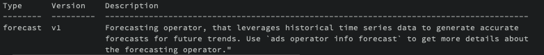
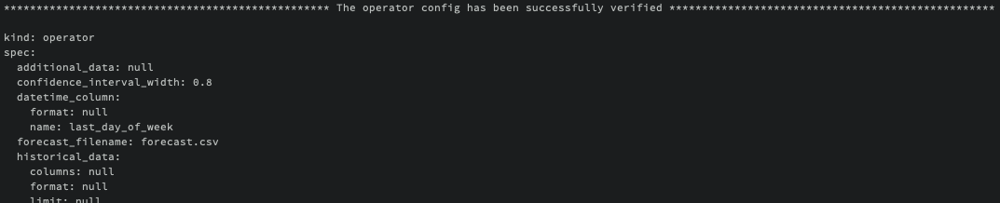
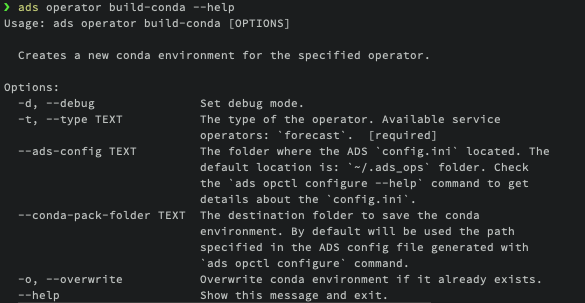
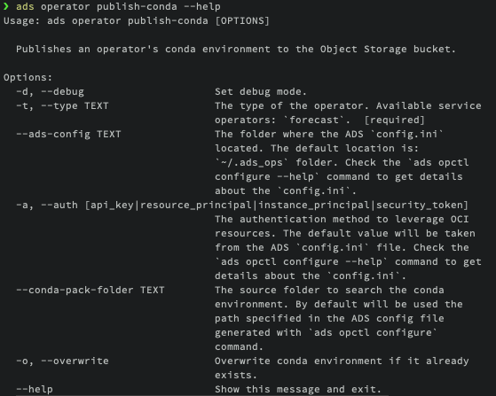

=============================
Explore & Configure Operators
=============================

After ensuring that you have all the necessary prerequisites in order, the next step is to explore and configure the operators. This guide will take you through the process, utilizing the Command Line Interface (CLI) tool to assist you in this endeavor. This step is a preliminary one that precedes the execution of operators.

.. admonition:: Prerequisites
  :class: note

  Before we start, let's ensure you have everything you need for easy starting. If you haven't already, install the accompanying CLI tool, detailed installation instructions can be found in the links below.

  -  :doc:`Install ADS CLI<../../cli/quickstart>`
  -  :doc:`Configure Defaults<../../cli/opctl/configure>`

CLI Overview
============

The ``ads opctl operator`` CLI tool is your trusty companion when working with operators. It simplifies the process, making it easy to explore the catalog of registered operators, gain insights into their specific use cases, and configure them to meet your needs. Additionally, this tool provides assistance in constructing Docker containers or setting up Conda environments to execute the operator, all while guiding you through the essential steps for running them.

Let's start from the very beginning by calling the following command in your terminal to see a list of supported CLI commands:

.. code-block:: bash

   ads opctl operator --help

This command provides a concise overview of all available commands.

- ``ads opctl operator list``: Retrieve a list of registered operators with this command.

- ``ads opctl operator info``: Obtain detailed information about a specific operator using this command. It offers comprehensive instructions on how to configure and run the operator across different environments and runtimes.

- ``ads opctl operator init``: Generate starter YAML configurations for an operator with this command.

- ``ads opctl operator verify``: Ensure the correctness of an operator's YAML specification using this command.

- ``ads opctl operator build-conda``: Build a new Conda environment tailored to a particular operator using this command.

- ``ads opctl operator publish-conda``: Publish the operator's Conda environment to the Object Storage bucket with this command.

- ``ads opctl operator build-image``: Create a new image customized for the operator using this command.

- ``ads opctl operator publish-image``: Publish the operator's image to the container registry with this command.

Listing Operators
-----------------

Begin by browsing our operator catalog to discover the pre-packaged solutions available for various data science tasks. The catalog provides short descriptions of each operator's capabilities and use cases.

.. code-block:: bash

   ads opctl operator list

Getting an Operator's Details
-----------------------------

Each operator is accompanied by highly detailed instructions explaining how it can be configured and executed in various environments.

.. code-block:: bash

   ads opctl operator info --help

.. code-block:: bash

   ads opctl operator info --name <operator-name>

Initializing an Operator's Configs
----------------------------------

The ``init`` command is indeed crucial as it generates the foundational configurations tailored for a specific operator.

Before you start, make sure to complete the :doc:`Configure Defaults<../../cli/opctl/configure>` step. This step is essential as it establishes default values for different options when running the operator on OCI Data Science jobs or OCI Data Flow applications. If you have already completed this setup and are using a flexible shape, remember to adjust the ``ml_job_config.ini`` and ``dataflow_config.ini`` files with the shape configuration details and ``docker_registry`` information.

**ml_job_config.ini**

- ``ocpus = 1``
- ``memory_in_gbs = 16``
- ``docker_registry = <iad.ocir.io/namespace/>``

**dataflow_config.ini**

- ``driver_shape = VM.Standard.E4.Flex``
- ``executor_shape = VM.Standard.E4.Flex``
- ``driver_shape_ocpus = 1``
- ``executor_shape_ocpus = 1``
- ``driver_shape_memory_in_gbs = 16``
- ``executor_shape_memory_in_gbs = 16``

Now let's explore the ``init`` command.

.. code-block:: bash

   ads opctl operator init --help

.. figure:: figures/operator_init.png
   :align: center

To create starter configuration files, execute the following command.

.. code-block:: bash

   ads opctl operator init -n <operator-name> --overwrite --output ~/<operator-name>

**The essential files generated include:**

- **<operator-name>.yaml**: Contains configuration related to particular operator.
- **backend_operator_local_python_config.yaml**: This file includes local backend configuration for running operator in a local environment. You must manually set up the environment before executing the operator.
- **backend_operator_local_container_config.yaml**: This file contains local backend configuration for running operator within a local container. You should build the container before running the operator, following the instructions below.
- **backend_job_container_config.yaml**: Contains Data Science job-related configuration for running operator in a container (BYOC) runtime. The container must be built and published before executing the operator, as detailed below. For comprehensive details about the supported configuration options, including the schema and available settings, please refer to the :doc:`OCI Data Science Jobs<../../jobs/yaml_schema>` documentation.
- **backend_job_python_config.yaml**: Contains Data Science job-related configuration to run operator in a Data Science job within a conda runtime. The conda environment should be built and published before running the operator. For comprehensive details about the supported configuration options, including the schema and available settings, please refer to the :doc:`OCI Data Science Jobs YAML Schema<../../jobs/yaml_schema>` documentation.
- **backend_dataflow_dataflow_config.yaml**: Contains Data Flow application-related configuration to run operator in a Data Flow application. The conda environment should be built and published before running the operator. For comprehensive details about the supported configuration options, including the schema and available settings, please refer to the :doc:`Data Flow Application YAML Schema<../../apachespark/datafloe>` documentation.

These generated configurations are designed to be ready for use without additional adjustments. However, they are provided as starter kit configurations that can be customized as needed.

The operator's configuration file, named as ``<operator-name>.yaml``, is generated based on the operator's schema and contains the essential input attributes required to run the operator. These attributes serve as the bare minimum configuration for the operator to function.

However, in cases where the operator requires specific input or output sources of data, you may need to adjust the configuration manually to accommodate these requirements.

Beyond the basic input attributes, additional configurations within the YAML file are generated based on the information provided during the pre-step of configuring defaults, as detailed in the :doc:`Configure Defaults<../../cli/opctl/configure>` documentation. These configurations are populated using environment variables as well, ensuring that the operator runs with the necessary settings and parameters.

In summary, while the core configuration is automatically generated from the operator's schema, you have the flexibility to fine-tune and customize the configuration to match your specific data science needs.

Verifying an Operator's Config
------------------------------

Before proceeding to run an operator, it's essential to verify the operator's configuration. Running an operator can be resource-intensive, so it's a valuable step to ensure that the configuration is correct before initiating the operation. Once you have obtained the operator's configuration (specification) in YAML format, you can use the following command to verify it:

.. code-block:: bash

   ads opctl operator verify --help

The configuration file can be located in an Object Storage bucket or in a local repository. To specify the authentication type, use the ``--auth`` attribute.

Verification helps you catch any errors or inconsistencies in the operator's configuration, ensuring that it will run smoothly and produce the desired results when executed.

.. code-block:: bash

   ads opctl operator verify -f ~/<operator-name>/config/<operator-name>.yaml

Building an Operator's Image
----------------------------

In order to run an operator within a local container or utilize it with the OCI Data Science Jobs service's BYOC (Bring Your Own Container) runtime, you must first create a dedicated container image for the specific operator. This process is straightforward and only requires that you have the Docker CLI installed on your local machine. Below, we outline the steps to build your custom container.

.. code-block:: bash

   ads opctl operator build-image --help

The fundamental attribute you need to provide is ``--name``, which represents the name of the operator. The operator's name and version will be automatically used as the image name and tag.

.. code-block:: bash

   ads opctl operator build-image --name <operator-name>

An interesting point to note is that the operator's container can be built to accommodate both CPU and GPU architectures, although this capability depends on the specific operator's requirements.

Once the operator's image is successfully built, you have the option to publish it to the `Oracle Container Registry <https://docs.oracle.com/en-us/iaas/Content/Registry/home.htm>`_. This publishing step becomes necessary when you intend to run the operator on the OCI Data Science Jobs service within the BYOC runtime.

Publishing an Operator's Image
-------------------------------

After successfully building the operator's image, the next step is to publish it to the `Oracle Container Registry <https://docs.oracle.com/en-us/iaas/Content/Registry/home.htm>`_. As mentioned previously, publishing the image is specifically required when you intend to run the operator on the OCI Data Science Jobs service within the BYOC runtime. Fortunately, this step is quite straightforward. Below, you'll find instructions on how to publish the image to the Container Registry.

.. code-block:: bash

   ads opctl operator publish-image --help

The only mandatory parameter for this command is the image name that you wish to publish.

.. code-block:: bash

   ads opctl operator publish-image --name <operator-name>

While the image name is the only required parameter, you also have the option to provide the ``registry`` parameter if needed. By default, the information about the registry where the container should be published is retrieved from the ADS config generated during the :doc:`Configure Defaults<../../cli/opctl/configure>` step.

For more detailed information on publishing containers, you can refer to the `Oracle Container Registry <https://docs.oracle.com/en-us/iaas/Content/Registry/home.htm>`_ documentation.

Building an Operator's Conda Environment
----------------------------------------

Another option for running an operator on OCI resources is to utilize a Conda environment. Building an operator's Conda environment is necessary if you intend to run the operator on the OCI Data Science Jobs service within the Conda runtime or on the Data Flow service. Additionally, the Conda environment can be employed within a Data Science Notebook Session to execute a specific operator.

To build the operator's Conda environment, follow these steps:

.. code-block:: bash

   ads opctl operator build-conda --help

The only mandatory parameter for this command is the ``--name`` of the operator. However, you also have the option to specify the destination folder for the Conda environment. By default, the information about the destination folder where the Conda environment should be created is retrieved from the ADS config generated during the :doc:`Configure Defaults<../../cli/opctl/configure>` step.

.. code-block:: bash

   ads opctl operator build-conda --name <operator-name>

Once you have successfully built the Conda environment, you will need to publish it to OCI Object Storage. This step allows the OCI Data Science Jobs and Data Flow services to utilize the Conda environment seamlessly.

Publishing an Operator's Conda Environment
------------------------------------------

To make a locally built Conda environment available in the OCI Object Storage bucket, follow these simple steps:

.. code-block:: bash

   ads opctl operator publish-conda --help

For instance, if you have constructed a Conda environment for the specific operator, the command would appear as follows:

.. code-block:: bash

   ads opctl operator publish-conda --name <operator-name>

Publishing the Conda environment to OCI Object Storage enables the OCI Data Science Jobs and Data Flow services to access and utilize this environment efficiently. This step is essential to ensure that your operators run seamlessly within the OCI ecosystem.
