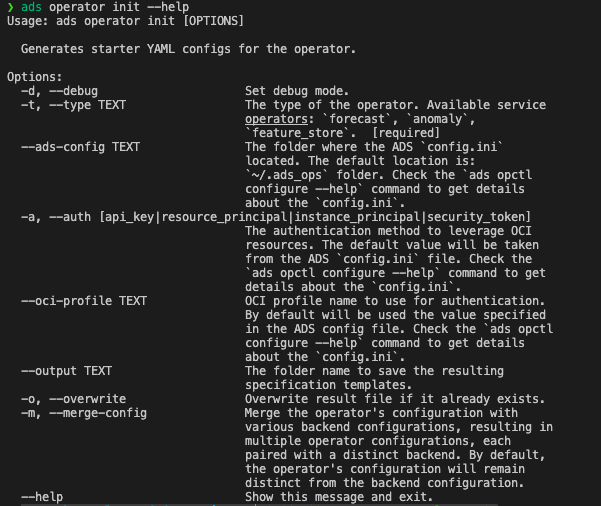

==========
How To Run
==========

It's time to run operators in your chosen backend.

.. admonition:: Prerequisites
  :class: note

  Before we start, let's ensure you have everything you need for easy starting. If you haven't already, install the accompanying CLI tool, detailed installation instructions can be found in the links below.

  -  :doc:`Install ADS CLI<../../cli/quickstart>`
  -  :doc:`Configure Defaults<../../cli/opctl/configure>`
  -  :doc:`Explore & Configure Operators<./explore>`
  -  :doc:`IAM Policies<./policies>`

The first step is to generate starter kit configurations that simplify the execution of the operator across different backends. This can be done easily using the following command:

.. code-block:: bash

    ads operator init --help

.. admonition:: Important
  :class: warning

    If the ``--merge-config`` flag is set to ``true``, the ``<operator-type>.yaml`` file will be merged with the backend configuration which contains pre-populated infrastructure and runtime sections. You don't need to provide a backend information separately in this case.

    .. code-block:: bash

        ads operator run -f <operator-type>.yaml

    Alternatively ``ads opctl run`` command can be used:

    .. code-block:: bash

        ads opctl run -f <operator-type>.yaml

    The operator will be run in chosen environment without requiring additional modifications.

Different Ways To Run Operator
------------------------------

To operator can be run in two different ways:

.. code-block:: bash

    ads operator run -f <operator-config>.yaml

Or alternatively:

.. code-block:: bash

    ads opctl run -f <operator-config>.yaml

Despite the presented above commands look equivalent, the ``ads operator run`` command is more flexible.
Here the few restrictions when running the operator within the ``ads opctl run`` command:

 - The ``<operator-config>.yaml`` file must contain all the necessary information for running the operator. This means that the ``<operator-config>.yaml`` file must contain the ``runtime`` section describing the backend configuration for the operator.
 - If the ``<operator-config>.yaml`` file not contains the ``runtime`` section, then the ``ads opctl run`` command can be used in restricted mode with ``-b`` option. This option allows you to specify the backend to run the operator on. The ``-b`` option can be used with the following backends: ``local``, ``dataflow``, ``job``. However you will not be able to use the ``-b`` option with the local ``container`` backend and Data Science Jobs ``container`` backend.

Run Operator Locally
--------------------

There are several ways to run the operator in your local environment. The first option is to run it in the environment you've prepared on your own, assuming you've already installed all the necessary operator packages. The second option is to run the operator within a Docker container, which requires building a Docker image for the operator.

Within Local Environment
~~~~~~~~~~~~~~~~~~~~~~~~

To run the operator locally, follow these steps:

1. Create and activate a new conda environment named ``<operator-type>``.
2. Install all the required libraries listed in the ``environment.yaml`` file generated by the ``ads operator init --type <operator-type>`` command.
3. Review the ``<operator-type>.yaml`` file generated by the ``ads operator init`` command and make necessary adjustments to input and output file locations. Notice that the ``<operator-type>.yaml`` will not be generated if the ``--merge-config`` flag is set to ``true``.
4. Verify the operator's configuration using the following command:

.. code-block:: bash

    ads operator verify -f <operator-config>.yaml

5. To run the operator within the ``<operator-type>`` conda environment, use this command:

.. code-block:: bash

    ads operator run -f <operator-type>.yaml -b local

The alternative way to run the operator would be to use the ``ads opctl run`` command:

.. code-block:: bash

    ads opctl run -f <operator-type>.yaml -b local

See the `Different Ways To Run Operator <#different-ways-to-run-operator>`_ section for more details.

Within Container
~~~~~~~~~~~~~~~~

To run the operator within a local container, follow these steps:

1. Build the operator's container using the following command:

.. code-block:: bash

    ads operator build-image --type <operator-type>

This command creates a new ``<operator-type>:<operator-version>`` image with ``/etc/operator`` as the working directory within the container.

2. Check the ``backend_operator_local_container_config.yaml`` configuration file. It should have a ``volume`` section with the ``.oci`` configs folder mounted, as shown below:

.. code-block:: yaml

    volume:
      - "/Users/<user>/.oci:/root/.oci"

Mounting the OCI configs folder is necessary if you intend to use an OCI Object Storage bucket to store input and output data. You can also mount ``input/output`` folders to the container as needed.

Following is the YAML schema for validating the runtime YAML using `Cerberus <https://docs.python-cerberus.org/en/stable/>`_:

.. literalinclude:: ../../../../../ads/opctl/operator/runtime/container_runtime_schema.yaml
    :language: yaml
    :linenos:

3. Run the operator within the container using this command::

.. code-block:: bash

    ads operator run -f <operator-type>.yaml -b backend_operator_local_container_config.yaml

Or within a short command:

.. code-block:: bash

    ads operator run -f <operator-type>.yaml -b local.container

The alternative way to run the operator would be to use the ``ads opctl run`` command. However in this case the runtime information needs to be merged within operator's config. See the `Different Ways To Run Operator <#different-ways-to-run-operator>`_ section for more details.

.. code-block:: bash

    ads opctl run -f <operator-type>.yaml

If the backend runtime information is not merged within operator's config, then there is no way to run the operator within the ``ads opctl run`` command using container runtime. The ``ads operator run`` command should be used instead.

Run Operator In Data Science Job
--------------------------------

.. admonition:: Prerequisites
  :class: note

    To become proficient with Data Science Jobs, it is recommended to explore their functionality thoroughly. Checking the :doc:`YAML Schema <../../jobs/yaml_schema>` link will assist you in configuring job YAML specifications more easily in the future.

  -  :doc:`Data Science Jobs <../../jobs/index>`
  -  :doc:`Run a Script <../../jobs/run_script>`
  -  :doc:`Run a Container <../../jobs/run_container>`
  -  :doc:`YAML Schema <../../jobs/yaml_schema>`

There are several options for running the operator on the OCI `Data Science Jobs <https://docs.oracle.com/en-us/iaas/data-science/using/jobs-about.htm>`_ service, such as using the :doc:`python runtime <../../jobs/run_python>` or the :doc:`Bring Your Own Container (BYOC) <../../jobs/run_container>` approach.

Run With BYOC (Bring Your Own Container)
~~~~~~~~~~~~~~~~~~~~~~~~~~~~~~~~~~~~~~~~

To execute the operator within a Data Science job using :doc:`container <../../jobs/run_container>`  runtime, follow these steps:

1. Build the container using the following command (you can skip this if you've already done it for running the operator within a local container):

.. code-block:: bash

   ads operator build-image --type <operator-type>

This creates a new ``<operator-type>:<operator-version>`` image with ``/etc/operator`` as the working directory within the container.

2. Publish the ``<operator-type>:<operator-version>`` container to the `Oracle Container Registry (OCR) <https://docs.oracle.com/en-us/iaas/Content/Registry/home.htm>`_.

To publish ``<operator-type>:<operator-version>`` to OCR, use this command:

.. code-block:: bash

   ads operator publish-image --type forecast --registry <iad.ocir.io/tenancy/>

After publishing the container to OCR, you can use it within Data Science jobs service. Check the ``backend_job_container_config.yaml`` configuration file built during initializing the starter configs for the operator. It should contain pre-populated infrastructure and runtime sections. The runtime section should have an image property, like ``image: iad.ocir.io/<tenancy>/<operator-type>:<operator-version>``.

3. Adjust the ``<operator-type>.yaml`` configuration with the proper input/output folders. When running operator in a Data Science job, it won't have access to local folders, so input data and output folders should be placed in the Object Storage bucket. Open the ``<operator-type>.yaml`` and adjust the data path fields.

4. Run the operator on the Data Science jobs using this command:

.. code-block:: bash

   ads operator run -f <operator-type>.yaml -b backend_job_container_config.yaml

Or within a short command:

.. code-block:: bash

    ads operator run -f <operator-type>.yaml -b job.container

In this case the backend config will be built on the fly.
However the recommended way would be to use explicit configurations for both operator and backend.

The alternative way to run the operator would be to use the ``ads opctl run`` command. However in this case the runtime information needs to be merged within operator's config. See the `Different Ways To Run Operator <#different-ways-to-run-operator>`_ section for more details.

.. code-block:: bash

    ads opctl run -f <operator-type>.yaml

If the backend runtime information is not merged within operator's config, then there is no way to run the operator within the ``ads opctl run`` command using container runtime. The ``ads operator run`` command should be used instead.

You can run the operator within the ``--dry-run`` attribute to check the final configs that will be used to run the operator on the service. This command will not run the operator, but will print the final configs that will be used to run the operator on the service.

Running the operator will return a command to help you monitor the job's logs:

.. code-block:: bash

   ads opctl watch <OCID>

Run With Conda Environment
~~~~~~~~~~~~~~~~~~~~~~~~~~

To execute the operator within a Data Science job using the conda runtime, follow these steps:

1. Build the operator's conda environment using this command::

.. code-block:: bash

    ads operator build-conda --type <operator-type>

This creates a new ``<operator-type>_<operator-version>`` conda environment and places it in the folder specified within the ``ads opctl configure`` command.

2. Publish the ``<operator-type>_<operator-version>`` conda environment to the Object Storage bucket using this command::

.. code-block:: bash

    ads operator publish --type <operator-type>

For more details on configuring the CLI, refer to the :doc:`Explore & Configure Operators<./explore>` documentation.

3. After publishing the conda environment to Object Storage, you can use it within the Data Science Jobs service. Check the ``backend_job_python_config.yaml`` configuration file, which should contain pre-populated infrastructure and runtime sections. The runtime section should include a ``conda`` section like this::

.. code-block:: yaml

    conda:
      type: published
      uri: oci://bucket@namespace/conda_environments/cpu/<operator-type>/<operator-version>/<operator-type>_<operator-version>

4. Adjust the ``<operator-type>.yaml`` configuration with the proper input/output folders. When running the operator in a Data Science job, it won't have access to local folders, so input data and output folders should be placed in the Object Storage bucket.

5. Run the operator on the Data Science Jobs service using this command::

.. code-block:: bash

    ads operator run -f <operator-type>.yaml -b backend_job_python_config.yaml

Or within a short command:

.. code-block:: bash

    ads operator run -f <operator-type>.yaml -b job

In this case the backend config will be built on the fly.
However the recommended way would be to use explicit configurations for both operator and backend.

The alternative way to run the operator would be to use the ``ads opctl run`` command. However in this case the runtime information needs to be merged within operator's config. See the `Different Ways To Run Operator <#different-ways-to-run-operator>`_ section for more details.

.. code-block:: bash

    ads opctl run -f <operator-type>.yaml

Or if the backend runtime information is not merged within operator's config:

.. code-block:: bash

    ads opctl run -f <operator-type>.yaml -b job

6. Monitor the logs using the ``ads opctl watch`` command::

.. code-block:: bash

    ads opctl watch <OCID>

Data Flow Application
---------------------

To execute the operator within a Data Flow application follow these steps:

1. Build the operator's conda environment using this command::

.. code-block:: bash

    ads operator build-conda --type <operator-type>

This creates a new ``<operator-type>_<operator-version>`` conda environment and places it in the folder specified within the ``ads opctl configure`` command.

2. Publish the ``<operator-type>_<operator-version>`` conda environment to the Object Storage bucket using this command::

.. code-block:: bash

    ads operator publish --type <operator-type>

For more details on configuring the CLI, refer to the :doc:`Explore & Configure Operators<./explore>` documentation.

After publishing the conda environment to Object Storage, you can use it within the Data Flow service. Check the ``backend_dataflow_dataflow_config.yaml`` configuration file, which should contain pre-populated infrastructure and runtime sections. The runtime section should include a ``conda`` section like this:

.. code-block:: yaml

    conda:
      type: published
      uri: oci://bucket@namespace/conda_environments/cpu/<operator-type>/<operator-version>/<operator-type>_<operator-version>

3. Adjust the ``<operator-type>.yaml`` configuration with the proper input/output folders. When running the operator in a Data Flow application, it won't have access to local folders, so input data and output folders should be placed in the Object Storage bucket.

4. Run the operator on the Data Flow service using this command::

.. code-block:: bash

    ads operator run -f <operator-type>.yaml -b backend_dataflow_dataflow_config.yaml

Or within a short command:

.. code-block:: bash

    ads operator run -f <operator-type>.yaml -b dataflow

In this case the backend config will be built on the fly.
However the recommended way would be to use explicit configurations for both operator and backend.

The alternative way to run the operator would be to use the ``ads opctl run`` command. However in this case the runtime information needs to be merged within operator's config. See the `Different Ways To Run Operator <#different-ways-to-run-operator>`_ section for more details.

.. code-block:: bash

    ads opctl run -f <operator-type>.yaml

Or if the backend runtime information is not merged within operator's config:

.. code-block:: bash

    ads opctl run -f <operator-type>.yaml -b dataflow

5. Monitor the logs using the ``ads opctl watch`` command::

.. code-block:: bash

    ads opctl watch <OCID>
