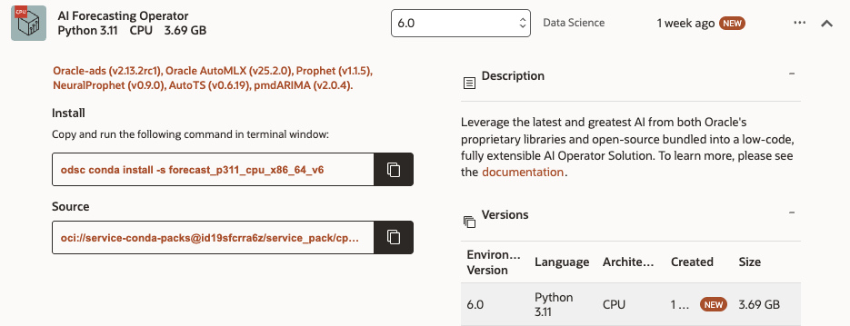
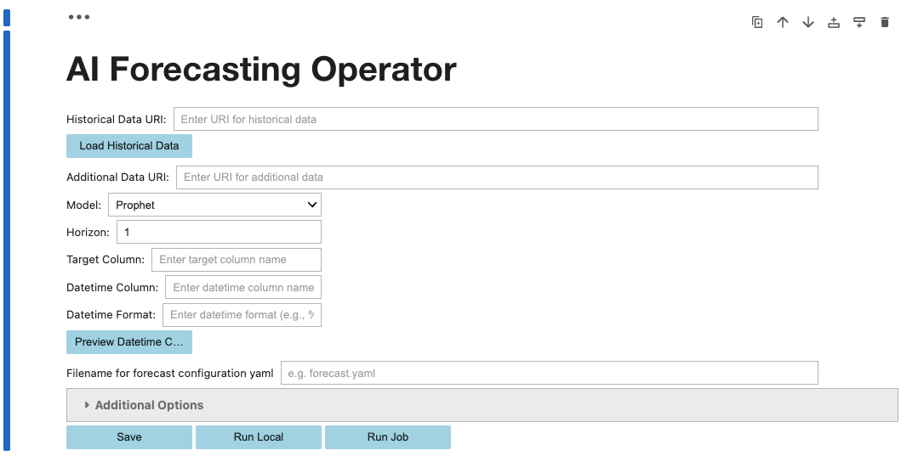
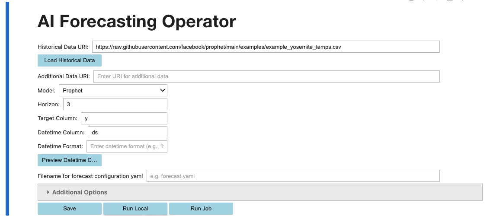

====================
AI Forecast Operator
====================

The AI Forecast Operator leverages historical time series data to generate accurate forecasts for future trends. This operator simplifies and accelerates the data science process by automating model selection, hyperparameter tuning, and feature identification for a given prediction task.

📦 Installation
================

On a Notebook Session (OCI Data Science)
-----------------------------------------

.. code-block:: bash

  odsc conda install -s forecast_p311_cpu_x86_64_v6 
  conda activate /home/datascience/conda/forecast_p311_cpu_x86_64_v6

Locally
----------

.. code-block:: bash

  pip install "oracle_ads[forecast]"

---

🚀 Getting Started
==================

Using the CLI
--------------

.. code-block:: yaml

  # forecast.yaml
  kind: operator
  type: forecast
  version: v1
  spec:
      datetime_column:
          name: ds
      historical_data:
          url: https://raw.githubusercontent.com/facebook/prophet/main/examples/example_yosemite_temps.csv
      horizon: 3
      model: prophet
      target_column: y

.. code-block:: bash

  ads operator run -f forecast.yaml

---

Using the API
---------------

.. code-block:: python

  from ads.opctl.forecast import operate, ForecastOperatorConfig

  spec = {
    "spec": {
      "historical_data": {"url": "https://raw.githubusercontent.com/facebook/prophet/main/examples/example_yosemite_temps.csv"},
      "datetime_column": {"name": "ds"},
      "target_column": "y",
      "model": "prophet",
      "horizon": 3
      }
  }
  config = ForecastOperatorConfig.from_dict(spec)
  result = operate(config)

---

Using the Notebook UI
------------------------

.. code-block:: bash

  wget https://raw.githubusercontent.com/oracle-samples/oci-data-science-ai-samples/refs/heads/main/ai-operators/Forecast_UI.ipynb -O Forecast_UI.ipynb 

Simply fill in the fields and click "run":

---

🧠 Tweak the Model
===================

Select a specific model
-----------------------

.. code-block:: yaml

  model:
    name: arima

The model name can be any of the following:
- **Prophet** - Recommended for smaller datasets, and datasets with seasonality or holidays
- **ARIMA** - Recommended for highly cyclical datasets
- **AutoMLx** - Oracle Lab's proprietary modelling framework
- **NeuralProphet** - Recommended for large or wide datasets
- **AutoTS** - M6 Benchmark winner. Recommended if the other frameworks aren't providing enough accuracy
- **Auto-Select** - The best of all of the above. Recommended for comparing the above frameworks. Caution, it can be very slow.

Auto-Select the Best Model
---------------------------

``Auto-Select`` will backtest all models and select the best performing model. 
Users can select which models to include using the ``model_list`` parameter.
Users can tune the number of backtests per model using the ``num_backtests`` parameter, which is 5 by default.
Users can adjust the portion of the data to backtest on using the ``sample_ratio`` parameter. The default of 0.2 means that all backtests will be trained on at least the first 80% of data, and the cross validation will occur over the most recent 20% of the data.

.. code-block:: yaml

  model:
    name: auto-select
  model_kwargs:
    model_list: ["prophet", "arima", "neuralprophet"]
    sample_ratio: 0.2
    num_backtests: 5

Additional Modeling Options
----------------------------

The Operator offers several additional parameters to ensure it's generating the best model possible.
In prophet models, users can specify the ``min`` and ``max`` parameters, which dictate the smallest and largest value possible. This is useful for percentages or revenues - quantities that are naturally bounded on their upper or lower values.
In prophet models, users can specify a monthly seasonality with the parameter ``monthly_seasonality``. By default, monthly seasonality will only be fit if the trend is very strong.

.. code-block:: yaml

  model:
    name: prophet
  model_kwargs:
    min: 0
    max: 100
    monthly_seasonality: True

Full Extensible Control over the Model
---------------------------------------

Users have the option to take full control of the modeling and pass through whatever parameters they like to the underlying framework.
With ``prophet``, for instance, there are options to dictate seasonality and changepoints. In the example below, anything passed to ``model_kwargs`` will be passed through to prophet (excluding a few key parameters Operators extracts). 

.. code-block:: yaml

  model:
    name: prophet
  model_kwargs:
    seasonality_mode: multiplicative
    changepoint_prior_scale: 0.05

---

➕ Add Additional Column(s)
===========================

Additional data is essential for multivariate modeling.

Structuring Data
----------------

Multivariate forecasting differs from other multivariate machine learning problems. In forecasting, all additional variables must be known over the entire forecast horizon. Consequently, the Forecast Operator **requires** ``additional_data`` to cover the full horizon. For example, if you're forecasting the peak temperature for tomorrow, you cannot use tomorrow's humidity because it's unknown. However, many enterprise scenarios do not face this issue, as retailers often have long-term marketing plans with knowable future expenditures, holidays are predictable, etc. In some cases, users might make assumptions for a "what-if" analysis.

Sometimes, variables are useful but unknowable in advance. For these cases, we recommend *lagging* the variable. To lag a variable, shift all its values so that the horizon is filled with data. Typically, users shift by the entire horizon, though advanced users may shift by more or less depending on their needs. Essentially, the operator uses the humidity from five days ago to predict today's peak temperature.

The additional data must always share the same datetime column as the historical data and must extend beyond the horizon. In other words, the number of rows in ``additional_data`` should equal the number of rows in the historical data plus the horizon.

If the historical data includes a ``target_category_columns``, it should also be present in the additional data.

For example, if the historical data is:

===========   ========= 
 Month        Revenue 
===========   ========= 
 01-01-2024    1200     
 01-02-2024    1300  
 01-03-2024    1500  
===========  ========= 

Then the additional data (with a horizon of 1) should be formatted as:

===========    ========  ========  ==============
 Month          COGS    Discount   SP500 Futures
===========    ========  ========  ==============
 01-01-2024    100        0        1.02
 01-02-2024    100        0.1      1.03
 01-03-2024    105        0        1.04
 01-04-2024    105        0.1      1.01
===========   ========  ========  ==============

Note that the additional data does not include the target column (Revenue), but it does include the datetime column (Qtr). You would include this additional data in the YAML file as follows:

.. code-block:: yaml

    kind: operator
    type: forecast
    version: v1
    spec:
        datetime_column:
            name: Month
        historical_data:
            url: historical_data.csv
        additional_data:
            url: additional_data.csv
        horizon: 1
        model: prophet
        target_column: Revenue

You can experiment by removing columns and observing how the results change. Below is an example of ingesting only two of the three additional columns:

.. code-block:: yaml

    kind: operator
    type: forecast
    version: v1
    spec:
        datetime_column:
            name: Month
        historical_data:
            url: historical_data.csv
        additional_data:
            url: additional_data.csv
            columns:
                - Discount
                - SP500 Futures
        horizon: 1
        model: prophet
        target_column: Revenue

Multiple Related Forecasts
==========================

Often times in forecasting there are multiple related forecasts we want to perform simultaneously. For example, a store owner may want to forecast the sales of all 1000 of their SKUs. This store owner can run the Operator once on all of the SKUs, generate thousands of models, and compare the results in 1 simple report.
The key to running multiple related forecasts is the ``target_category_columns`` parameter. Our store owner can set the ``target_category_columns = SKU_ID``

===========   =========   ========= 
 Month        Revenue      SKU_ID
===========   =========   ========= 
 01-01-2024    1000         1
 01-01-2024    2000         2
 01-02-2024    1500         1
 01-02-2024    2100         2
===========  =========    ========= 

The store owner may also wish to run a multi-variate forecast and  thus include ``additional_data``. In this case, ensure the ``SKU_ID`` is also included in the additional data:

===========  ========  ==============  =========
 Month       Discount   SP500 Futures   SKU_ID
===========  ========  ==============  =========
 01-01-2024    0        1.02              1
 01-01-2024    0.1      1.02              2
 01-02-2024    0.1      1.04              1
 01-02-2024    0        1.04              2
 01-03-2024    0.1      1.01              1
 01-03-2024    0.1      1.01              2
===========   ========  ==============   ========= 

Notice that this additional_data would only be capable of forecasting a horizon of 1 (on 01-03-2024).

----

Sourcing Data
=================

The Operator can read data from the following sources:

- Oracle RDBMS
- OCI Object Storage
- OCI Data Lake
- HTTPS
- S3
- Azure Blob Storage
- Google Cloud Storage
- Local file systems

Additionally, the operator supports any data source supported by `fsspec <https://filesystem-spec.readthedocs.io/en/latest/_modules/fsspec/registry.html>`_.

Reading from OCI Object Storage
-------------------------------

Below is an example of reading data from OCI Object Storage using the operator:

.. code-block:: yaml

    kind: operator
    type: forecast
    version: v1
    spec:
        datetime_column:
            name: ds
        historical_data:
            url: oci://<bucket_name>@<namespace_name>/example_yosemite_temps.csv
        horizon: 3
        target_column: y

Reading from Oracle Database
----------------------------

Below is an example of reading data from an Oracle Database:

.. code-block:: yaml

    kind: operator
    type: forecast
    version: v1
    spec:
        historical_data:
            connect_args:
                user: XXX
                password: YYY
                dsn: "localhost/orclpdb"
            sql: 'SELECT Store_ID, Sales, Date FROM live_data'
        datetime_column:
            name: ds
        horizon: 1
        target_column: y

Data Preprocessing
------------------

The forecasting operator simplifies powerful data preprocessing. By default, it includes several preprocessing steps to ensure dataset compliance with each framework. However, users can disable one or more of these steps if needed, though doing so may cause the model to fail. Proceed with caution.

Default preprocessing steps:
- Missing value imputation
- Outlier treatment

To disable ``outlier_treatment``, modify the YAML file as shown below:

.. code-block:: yaml

    kind: operator
    type: forecast
    version: v1
    spec:
        datetime_column:
            name: ds
        historical_data:
            url: https://raw.githubusercontent.com/facebook/prophet/main/examples/example_yosemite_temps.csv
        horizon: 3
        target_column: y
        preprocessing: 
            enabled: true
            steps:
                missing_value_imputation: True
                outlier_treatment: False

Real-Time Trigger
-----------------

The Operator can be run locally or on an OCI Data Science Job. The resultant model can be saved and deployed for future use if needed. For questions regarding this integration, please reach out to the OCI Data Science team.

🧠 Enable Explainability
=========================

When additional data is provided, the Operator can optionally generate explanations for these additional features (columns) using SHAP values. Users can enable explanations in the YAML file:

.. code-block:: yaml

    kind: operator
    type: forecast
    version: v1
    spec:
        datetime_column:
            name: ds
        historical_data:
            url: https://raw.githubusercontent.com/facebook/prophet/main/examples/example_pedestrians_covid.csv
        additional_data:
            url: additional_data.csv
        horizon: 3
        model: prophet
        target_column: y
        generate_explanations: True

---

🧾 Disable File Generation
============================

.. code-block:: yaml

    spec:
        generate_forecast_file: False
        generate_explanations_file: False
        generate_metrics_file: False

---

📏 Change Evaluation Metric
============================

Different use cases optimize for different metrics. The Operator allows users to specify the metric they want to optimize from the following list:

- MAPE
- RMSE
- SMAPE
- MSE

The metric can be optionally specified in the YAML file (default: "smape"):

.. code-block:: yaml

    kind: operator
    type: forecast
    version: v1
    spec:
        datetime_column:
            name: ds
        historical_data:
            url: https://raw.githubusercontent.com/facebook/prophet/main/examples/example_yosemite_temps.csv
        horizon: 3
        model: prophet
        target_column: y
        metric: rmse

---

🧵 Run as a Job
============================

Using the CLI, Operators can easily be run as a job using the ``backend`` parameter:

.. code-block:: bash

  ads operator run -f forecast.yaml -b job

.. toctree::
  :maxdepth: 1

  ./quickstart
  ./data_sources
  ./scalability
  ./multivariate
  ./install
  ./development
  ./use_cases
  ./yaml_schema
  ./faq
