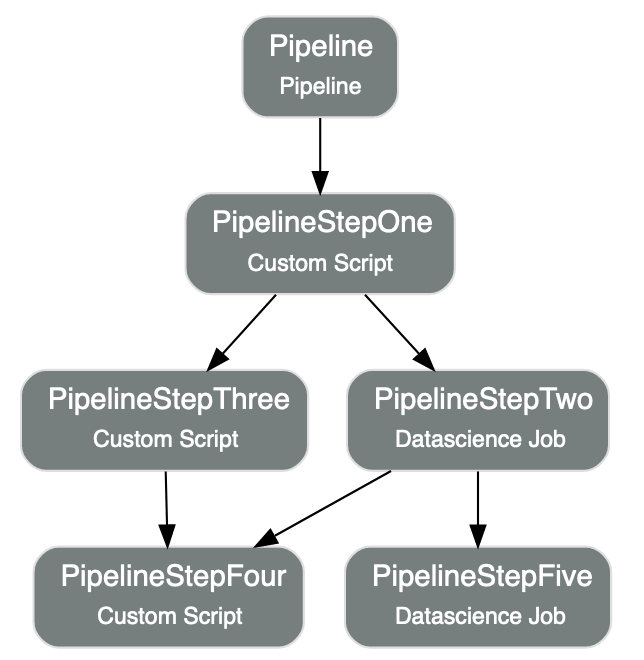

Pipeline
********

A pipeline is a workflow of tasks, called steps. Steps can run in sequence or in parallel, creating a Directed Acyclic Graph (DAG) of the steps.

Define
======

In an ADS pipeline module, you can either use the Python API or YAML to define a pipeline. 
In addition to the configuration of the pipeline, you provide the details of :ref:`Pipeline Step <pipeline_step>`
and the DAG of the pipeline steps (which defines the dependencies between the steps). 

DAG
^^^

DAG is used to define the dependencies between the steps. 

- ``>>`` denotes the tasks running in sequence, ``A >> B`` means that A is followed by B.
- ``()`` denotes the tasks running in parallel.
- If DAG not provided, all the steps will run in parallel.

In the example below, `step_name_1` and `step_name_2` will run in parallel, 
and `step_name_3` will start after both `step_name_1` and `step_name_2` are complete.

.. code-block:: yaml
  
  (step_name_1, step_name_2) >> step_name_3

Logs
^^^^

Both the log OCID and corresponding log group OCID can be specified in the ``Pipeline`` instance. If you specify only the log group OCID and no log OCID, a new Log resource is automatically created within the log group to store the logs, see `ADS Logging <../logging/logging.html>`__.

There are two types of logs for pipeline runs, service log and custom log. When defining a pipeline:

- to enable custom log, specify ``log_id`` and ``log_group_id``.
- to enable service log, specify ``log_group_id`` and set ``enable_service_log`` to ``True``. 
- to enable both types of logs, specify ``log_id`` and ``log_group_id``, and set ``enable_service_log`` to ``True``. 

With the specified DAG and pre-created pipeline steps, you can define a pipeline and give it a name.
A ``Pipeline`` instance will be created. 

.. tabs::

  .. code-tab:: Python3
    :caption: YAML
    
    from ads.pipeline import Pipeline

    yaml_string = """
    kind: pipeline
    spec:
      compartmentId: ocid1.compartment..<unique_id>
      dag:
      - pipeline_step_name_1 >> pipeline_step_name_2
      description: <pipeline_description>
      displayName: <pipeline_display_name>
      logGroupId: ocid1.loggroup.oc1..<unique_id>
      logId: ocid1.log..<unique_id>
      enableServiceLog: True
      maximumRuntimeInMinutes: 20
      projectId: ocid1.datascienceproject..<unique_id>
      stepDetails:
      - kind: dataScienceJob
        spec:
          description: <pipeline_step_description>
          jobId: ocid1.datasciencejob..<unique_id>	
          name: pipeline_step_name_1
      - kind: customScript
        spec:
          description: <pipeline_step_description>
          infrastructure:
            kind: infrastructure
            spec:
              blockStorageSize: 200
              shapeConfigDetails:
                memoryInGBs: 32
                ocpus: 4
              shapeName: VM.Standard3.Flex
          name: pipeline_step_name_2
          runtime:
            kind: runtime
            spec:
              conda:
                slug: <slug>
                type: service
              scriptPathURI: oci://<bucket_name>@<namespace>/<prefix>/<script.py>
            type: script
    type: pipeline
    """

    pipeline = Pipeline.from_yaml(yaml_string)
      

  .. code-tab:: Python3
    :caption: Python
    
    from ads.pipeline import PipelineStep, Pipeline

    pipeline_step_one = (
      PipelineStep("<pipeline_step_name_1>")
      .with_description("<pipeline_step_description>")
      .with_job_id("<job_id>")
    )

    infrastructure = (
        CustomScriptStep()
        .with_block_storage_size(200)
        .with_shape_name("VM.Standard3.Flex")
        .with_shape_config_details(ocpus=4, memory_in_gbs=32)
    )

    runtime = (
        ScriptRuntime()
        .with_source("oci://<bucket_name>@<namespace>/<prefix>/<script.py>")
        .with_service_conda("<slug>")
    )

    pipeline_step_two = (
        PipelineStep("<pipeline_step_name_2>")
        .with_description("<step_description>")
        .with_infrastructure(infrastructure)
        .with_runtime(runtime)
    )

    pipeline = (
        Pipeline("<pipeline_name>")
        .with_compartment_id("<compartment_id>")
        .with_project_id("<project_id>")
        .with_log_group_id("<log_group_id>")
        .with_log_id("<log_id>")
        .with_enable_service_log(True)         # to stream service log in pipeline runs
        .with_step_details([pipeline_step_one, pipeline_step_two])
        .with_dag(["pipeline_step_name_1 >> pipeline_step_name_2"])
    )

Create
======

You can call the ``create()`` method of the ``Pipeline`` instance to create a pipeline.  

.. code-block:: python3
  
  # Create a pipeline
  pipeline.create()

Run
===
You can call the ``run()`` method of the ``Pipeline`` instance to launch a new Pipeline Run. 
It returns a ``PipelineRun`` instance.

The ``run()`` method gives you the option to override the configurations in a pipeline run. It takes the following optional parameters:

  - ``display_name: str, optional``. Defaults to ``None``. The display name of the run.
  - ``project_id: str, optional``. Defaults to ``None``. The project id to override the one defined previously.
  - ``compartment_id: str, optional``. Defaults to ``None``. The compartment id to override the one defined previously. 
  - ``configuration_override_details: dict, optional``. Defaults to ``None``. The configuration details dictionary to override the one defined previously. The ``configuration_override_details`` contains the following keys:
  ``type``: str, only ``DEFAULT`` is allowed; 
  ``environment_variables``: dict, the environment variables;
  ``command_line_arguments``: str, the command line arguments;
  ``maximum_runtime_in_minutes``: int, the maximum runtime allowed in minutes. 
  - ``log_configuration_override_details: dict, optional``. Defaults to ``None``. The log configuration details dictionary to override the one defined previously.
  - ``step_override_details: list[PipelineStepOverrideDetails], optional``. Defaults to ``None``. The step details list to override the one defined previously. 
  - ``free_form_tags: dict(str, str), optional``. Defaults to ``None``. The free from tags dictionary to override the one defined previously. 
  - ``defined_tags: dict(str, dict(str, object)), optional``. Defaults to ``None``. The defined tags dictionary to override the one defined previously.
  - ``system_tags: dict(str, dict(str, object)), optional``. Defaults to ``None``. The system tags dictionary to override the one defined previously. 

.. code-block:: python3
  
  # Run a pipeline, a pipeline run will be created and started
  pipeline_run = pipeline.run()

Load
====

Use the ``from_ocid()`` method from the ``Pipeline`` class to load an existing pipeline with its OCID provided. It returns a ``Pipeline`` instance.

.. code-block:: python3
  
  from ads.pipeline import Pipeline

  pipeline = Pipeline.from_ocid("ocid1.datasciencepipeline..<unique_id>")

Visualize
=========

Use the ``show()`` method on the ``Pipeline`` instance to visualize the pipeline in a graph.

The ``show()`` method takes the following optional parameter:

  - ``rankdir: (str, optional)``. Defaults to ``TB``. The allowed values are ``TB`` or ``LR``. This parameter is applicable only for ``graph`` mode and it renders the direction of the graph as either top to bottom (TB) or left to right (LR).

.. code-block:: python3
  
  pipeline.show()

Below is an example of the output.

Delete
======

Use the ``delete()`` method on the ``Pipeline`` instance to delete a pipeline. It takes the following optional parameters:

  - ``delete_related_pipeline_runs: (bool, optional)``. Specify whether to delete related PipelineRuns or not. Defaults to ``True``.
  - ``delete_related_job_runs: (bool, optional)``. Specify whether to delete related JobRuns or not. Defaults to ``True``.
  - ``max_wait_seconds: (int, optional)``. The maximum time to wait, in seconds. Defaults to ``1800``.

A pipeline can only be deleted when its associated pipeline runs are all deleted, 
or alternatively, set the parameter ``delete_related_pipeline_runs`` to delete all associated runs in the same operation.
Delete fails if a PipelineRun is in progress.

.. code-block:: python3
  
  pipeline.delete()