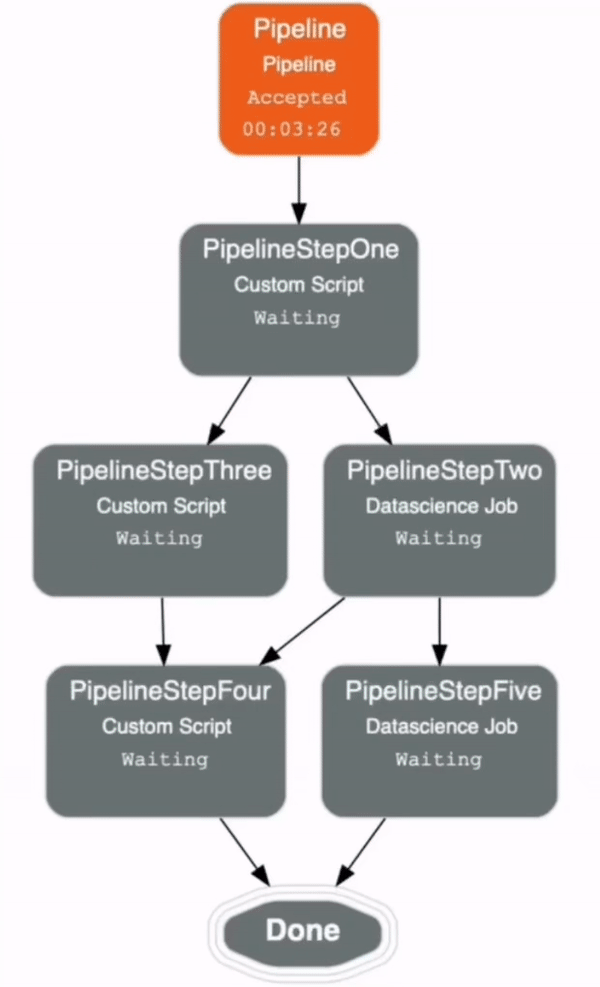

.. _pipeline_run:

Pipeline Run
************

Pipeline Run is the execution instance of a pipeline. Each pipeline run includes its step runs. A pipeline run can be configured to override some of the pipeline's defaults before starting the execution.

With a ``PipelineRun`` instance, you can watch the status of the run and stream logs for the pipeline run and the step runs. 

Watch status
============

Use the ``show()`` method of the ``PipelineRun`` instance to watch the status of pipeline run.

The ``show()`` method takes the following optional parameter:

  - ``mode: (str, optional)``. Defaults to ``graph``. The allowed values are ``text`` or ``graph``. This parameter renders the current status of pipeline run as either ``text`` or ``graph``.
  - ``wait: (bool, optional)``. Defaults to ``False`` and it only renders the current status of each step run in graph. If set to ``True``, it renders the current status of each step run until the entire pipeline is complete.
  - ``rankdir: (str, optional)``. Defaults to ``TB``. The allowed values are ``TB`` or ``LR``. This parameter is applicable only for ``graph`` mode and it renders the direction of the graph as either top to bottom (TB) or left to right (LR).

To watch the live update of each step run status in text until the entire pipeline is complete

.. code-block:: python3
  
  pipeline_run.show(mode="text", wait=True)

.. code-block:: text

  Step                Status
  ------------------  ---------
  PipelineStepOne:    Succeeded
  PipelineStepTwo:    Succeeded
  PipelineStepThree:  Succeeded
  PipelineStepFour:   In Progress
  PipelineStepFive:   Accepted

To watch the live update of each step run status in graph mode

.. code-block:: python3
  
  pipeline_run.show(wait=True)

Below is an example of the output.

Monitor Logs
============

Use the ``watch()`` method on the ``PipelineRun`` instance to stream the service, custom, or consolidated log of the pipeline run.
The ``watch()`` method takes the following optional parameters:

- ``steps: (list, optional)``. Defaults to ``None`` and streams the log of the pipeline run. If a list of the step names is provided, the method streams the log of the specified pipeline step runs.
- ``log_type: (str, optional)``. Defaults to ``None``.  The allowed values are ``custom_log``, ``service_log``, or ``None``. If ``None`` is provided, the method streams both service and custom logs.
- ``interval: (float, optional)``. Defaults value is ``3``. Time interval in seconds between each request to update the logs.

Stream the consolidated log of the pipeline run.

.. code-block:: python3

  pipeline_run.watch()

.. code-block:: text

  [S] - service log, [C] - custom log
  [S] - 2022-10-31 08:54:47 - Step PipelineStepOne is starting.
  [S] - 2022-10-31 08:55:36 - Step PipelineStepOne is ACCEPTED, lifecycle details: Infrastructure provisioning.
  [S] - 2022-10-31 08:56:39 - Step PipelineStepOne is ACCEPTED, lifecycle details: Step run bootstrap starting.
  [C] - 2022-10-31 08:57:18 - This is a custom log for PipelineStepOne.
  [S] - 2022-10-31 08:57:39 - Step PipelineStepOne is IN_PROGRESS, lifecycle details: Step run artifact execution in progress.
  [S] - 2022-10-31 08:58:39 - Step PipelineStepOne is SUCCEEDED.
  [S] - 2022-10-31 08:59:54 - Step PipelineStepThree is starting.
  [S] - 2022-10-31 09:00:15 - Step PipelineStepTwo is starting.
  [S] - 2022-10-31 09:00:44 - Step PipelineStepThree is ACCEPTED, lifecycle details: Infrastructure provisioning.
  [S] - 2022-10-31 09:00:53 - Step PipelineStepTwo is ACCEPTED, lifecycle details: Infrastructure provisioning.
  [S] - 2022-10-31 09:02:46 - Step PipelineStepThree is ACCEPTED, lifecycle details: Step run bootstrap starting.
  [S] - 2022-10-31 09:02:54 - Step PipelineStepTwo is ACCEPTED, lifecycle details: Step run bootstrap starting.
  [C] - 2022-10-31 09:03:13 - This is a custom log for PipelineStepThree.
  [C] - 2022-10-31 09:03:13 - This is a custom log for PipelineStepTwo.
  ...

Stream the service log of the pipeline run. 

.. code-block:: python3
  
  pipeline_run.watch(log_type="service_log") 
  
.. code-block:: text

  [S] - service log
  [S] - 2022-10-31 08:54:47 - Step PipelineStepOne is starting.
  [S] - 2022-10-31 08:55:36 - Step PipelineStepOne is ACCEPTED, lifecycle details: Infrastructure provisioning.
  [S] - 2022-10-31 08:56:39 - Step PipelineStepOne is ACCEPTED, lifecycle details: Step run bootstrap starting.
  [S] - 2022-10-31 08:57:39 - Step PipelineStepOne is IN_PROGRESS, lifecycle details: Step run artifact execution in progress.
  [S] - 2022-10-31 08:58:39 - Step PipelineStepOne is SUCCEEDED.
  [S] - 2022-10-31 08:59:54 - Step PipelineStepThree is starting.
  [S] - 2022-10-31 09:00:15 - Step PipelineStepTwo is starting.
  ...

Stream the custom log of the specified steps. 

.. code-block:: python3
  
  pipeline_run.watch(steps=['<step_name1>', '<step_name2>'], log_type="custom_log")

Load
====

Use the ``from_ocid()`` method from the ``PipelineRun`` class to load an existing pipeline run with its OCID provided. The method returns a ``PipelineRun`` instance.

.. code-block:: python3
  
  from ads.pipeline import PipelineRun

  pipeline_run = PipelineRun.from_ocid("ocid1.datasciencepipelinerun..<unique_id>")

Cancel
======

Use the ``cancel()`` method on the ``PipelineRun`` instance to cancel a pipeline run.

Pipeline Runs can only be canceled when they are in the ACCEPTED or IN_PROGRESS state.

.. code-block:: python3
  
  pipeline_run.cancel()

  

Delete
======

Use the ``delete()`` method on the ``PipelineRun`` instance to delete a pipeline run. It takes the following optional parameter:

  * ``delete_related_job_runs: (bool, optional)``. Specify whether to delete related JobRuns or not. Defaults to ``True``.
  * ``max_wait_seconds: (int, optional)``. The maximum time to wait in seconds. Defaults to ``1800``.

Pipeline runs can only be deleted when they are already in a SUCCEEDED, FAILED, or CANCELED state.

.. code-block:: python3
  
  pipeline_run.delete()

