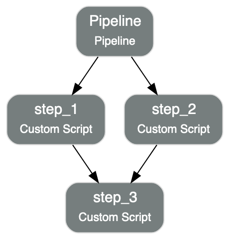

Quick Start
***********

ADS Python SDK
==============

The following sections provide sample code to define, create, and run a pipeline, including a visualization to track the pipeline run status.

The following example shows creating and runnning a pipeline with multiple steps. The steps ``step_1`` and ``step_2`` run in parallel and 
``step_3`` runs after ``step_1`` and ``step_2`` are complete. 

.. tabs::

  .. code-tab:: Python3
    :caption: Python

    from ads.pipeline import Pipeline, PipelineStep, CustomScriptStep, ScriptRuntime, NotebookRuntime
    import os 

    with open("script.py", "w") as f:
        f.write("print('Hello World!')")

    infrastructure = CustomScriptStep(
        block_storage_size=200,
        shape_name="VM.Standard3.Flex",
        shape_config_details={"ocpus": 4, "memory_in_gbs": 32},
    )

    script_runtime = ScriptRuntime(
        script_path_uri="script.py",
        conda={"type": "service", "slug": "tensorflow26_p37_cpu_v2"}
    )

    notebook_runtime = NotebookRuntime(
        notebook_path_uri="https://raw.githubusercontent.com/tensorflow/docs/master/site/en/tutorials/customization/basics.ipynb",
        conda={"type": "service", "slug": "tensorflow26_p37_cpu_v2"}
    )

    pipeline_step_1 = PipelineStep(
        name="step_1",
        description="A step running a python script",
        infrastructure=infrastructure,
        runtime=script_runtime
    )

    pipeline_step_2 = PipelineStep(
        name="step_2",
        description="A step running a notebook",
        infrastructure=infrastructure,
        runtime=notebook_runtime
    )

    pipeline_step_3 = PipelineStep(
        name="step_3",
        description="A step running a python script",
        infrastructure=infrastructure,
        runtime=script_runtime
    )

    compartment_id = os.environ['NB_SESSION_COMPARTMENT_OCID']
    project_id = os.environ["PROJECT_OCID"]

    pipeline = Pipeline(
        name="An example pipeline",
        compartment_id=compartment_id,
        project_id=project_id,
        step_details=[pipeline_step_1, pipeline_step_2, pipeline_step_3],
        dag=["(step_1, step_2) >> step_3"],
      )

    pipeline.create()      # create the pipeline
    pipeline.show()       # visualize the pipeline

    pipeline_run = pipeline.run()   # run the pipeline

    pipeline_run.show()     # watch the pipeline run status

  .. code-tab:: Python3
    :caption: Python (Alternative)

    from ads.pipeline import Pipeline, PipelineStep, CustomScriptStep, ScriptRuntime, NotebookRuntime
    import os

    with open("script.py", "w") as f:
        f.write("print('Hello World!')")

    infrastructure = (
        CustomScriptStep()
        .with_block_storage_size(200)
        .with_shape_name("VM.Standard3.Flex")
        .with_shape_config_details(ocpus=4, memory_in_gbs=32)
    )

    script_runtime = (
        ScriptRuntime()
        .with_source("script.py")
        .with_service_conda("generalml_p37_cpu_v1")
    )

    notebook_runtime = (
        NotebookRuntime()
        .with_notebook(
            path="https://raw.githubusercontent.com/tensorflow/docs/master/site/en/tutorials/customization/basics.ipynb",
            encoding='utf-8'
        )
        .with_service_conda("tensorflow26_p37_cpu_v2")
    )

    pipeline_step_1 = (
        PipelineStep("step_1")
        .with_description("A step running a python script")
        .with_infrastructure(infrastructure)
        .with_runtime(script_runtime)
    )

    pipeline_step_2 = (
        PipelineStep("step_2")
        .with_description("A step running a notebook")
        .with_infrastructure(infrastructure)
        .with_runtime(notebook_runtime)
    )

    pipeline_step_3 = (
        PipelineStep("step_3")
        .with_description("A step running a python script")
        .with_infrastructure(infrastructure)
        .with_runtime(script_runtime)
    )

    compartment_id = os.environ['NB_SESSION_COMPARTMENT_OCID']
    project_id = os.environ["PROJECT_OCID"]

    pipeline = (
          Pipeline("An example pipeline")
          .with_compartment_id(compartment_id)
          .with_project_id(project_id)
          .with_step_details([pipeline_step_1, pipeline_step_2, pipeline_step_3])
          .with_dag(["(step_1, step_2) >> step_3"])
      )

    pipeline.create()      # create the pipeline
    pipeline.show()       # visualize the pipeline

    pipeline_run = pipeline.run()   # run the pipeline

    pipeline_run.show()     # watch the pipeline run status

  .. code-tab:: Python3
    :caption: YAML
    
    from ads.pipeline import Pipeline
    import os

    compartment_id = os.environ['NB_SESSION_COMPARTMENT_OCID']
    project_id = os.environ["PROJECT_OCID"]

    with open("script.py", "w") as f:
        f.write("print('Hello World!')")

    yaml_string = """
    kind: pipeline
    spec:
      compartmentId: {compartment_id}
      displayName: An example pipeline
      projectId: {project_id}
      dag:
      - (step_1, step_2) >> step_3
      stepDetails:
      - kind: customScript
        spec:
          description: A step running a python script
          infrastructure:
            kind: infrastructure
            spec:
              blockStorageSize: 200
              shapeConfigDetails:
                memoryInGBs: 32
                ocpus: 4
              shapeName: VM.Standard3.Flex
          name: step_1
          runtime:
            kind: runtime
            spec:
              conda:
                slug: generalml_p37_cpu_v1
                type: service
              scriptPathURI: script.py
            type: script
      - kind: customScript
        spec:
          description: A step running a notebook
          infrastructure:
            kind: infrastructure
            spec:
              blockStorageSize: 200
              shapeConfigDetails:
                memoryInGBs: 32
                ocpus: 4
              shapeName: VM.Standard3.Flex
          name: step_2
          runtime:
            kind: runtime
            spec:
              conda:
                slug: tensorflow26_p37_cpu_v2
                type: service
              notebookEncoding: utf-8
              notebookPathURI: https://raw.githubusercontent.com/tensorflow/docs/master/site/en/tutorials/customization/basics.ipynb
            type: notebook
      - kind: customScript
        spec:
          description: A step running a python script
          infrastructure:
            kind: infrastructure
            spec:
              blockStorageSize: 200
              shapeConfigDetails:
                memoryInGBs: 32
                ocpus: 4
              shapeName: VM.Standard3.Flex
          name: step_3
          runtime:
            kind: runtime
            spec:
              conda:
                slug: generalml_p37_cpu_v1
                type: service
              scriptPathURI: script.py
            type: script
    type: pipeline
    """.format(compartment_id=compartment_id, project_id=project_id)

    pipeline = Pipeline.from_yaml(yaml_string)

    pipeline.create()      # create the pipeline
    pipeline.show()       # visualize the pipeline

    pipeline_run = pipeline.run()   # run the pipeline

    pipeline_run.show()     # watch the pipeline run status

ADS CLI
=======

**Prerequisites**

1. :doc:`Install ADS CLI<../cli/quickstart>`
2. :doc:`Configure Defaults<../cli/opctl/configure>`

Create / Run
------------

To build a brand new Data Science Pipeline and run it, provide the path to the pipeline YAML file with the ``--file`` option

.. code-block:: shell

  ads opctl run --file <path_to_pipeline_yaml>

Alternatively, to run an existing pipeline, provide the pipeline OCID with the ``--ocid`` option

.. code-block:: shell

  ads opctl run --ocid <pipeline_ocid>

Monitor
-------

To monitor a pipeline run, provide the pipeline run OCID and provide the log type with the ``-l`` option

Below is an example to stream the custom log

.. code-block:: shell

  ads opctl watch <pipeline_run_ocid> -l custom_log

.. admonition:: Tip

  The allowed values for ``-l`` option are ``custom_log``, ``service_log``, or ``None``.

Cancel
------

To cancel a pipeline run, provide the pipeline run OCID

.. code-block:: shell

  ads opctl cancel <pipeline_run_ocid>

Data Science Pipeline Runs can only be canceled when they are in the `ACCEPTED` or `IN_PROGRESS` state.

Delete
------

To delete a pipeline run, provide the pipeline run OCID

.. code-block:: shell

  ads opctl delete <pipeline_run_ocid>

Data Science Pipeline Runs can only be deleted when they are in the `SUCCEEDED`, `FAILED`, or `CANCELED` state.

To delete a pipeline, provide the pipeline OCID

.. code-block:: shell

  ads opctl delete <pipeline_ocid>

Data Science Pipelines can only be deleted when their associated pipeline runs are all deleted.

ADS Magic Commands
==================

.. admonition:: Tip

  Get more information about the pipeline extension by running ``%pipeline -h``

Installation
------------

Install the pipeline extension by running the following command

.. code-block:: shell

  %load_ext ads.pipeline.extension

Create / Run
------------

To build a brand new Data Science Pipeline and run it, provide the path to the pipeline YAML file with the ``--file`` option

.. code-block:: shell

  %pipeline run --file <path_to_pipeline_yaml>

Alternatively, to run an existing pipeline, provide the pipeline OCID with the ``--ocid`` option

.. code-block:: shell

  %pipeline run --ocid <pipeline_ocid>

Visualize
---------

To visualize a pipeline in a graph, use the pipeline OCID

.. code-block:: shell

  %pipeline show <pipeline_ocid>

Watch status
------------

To watch the status of pipeline run, use the pipeline run OCID

.. admonition:: Tip

  Get more information about watching pipeline status by running ``%pipeline status -h``

Below is an example of watching the status of pipeline run in ``graph`` mode until it finishes

.. code-block:: shell
  
  %pipeline status <pipeline_run_ocid> -w

Below is an example of watching the status of pipeline run in ``text`` mode

.. code-block:: shell
  
  %pipeline status <pipeline_run_ocid> -x

Monitor logs
------------

To monitor a pipeline run, use the pipeline run OCID.

.. admonition:: Tip

  Get more information about monitoring pipeline logs by running ``%pipeline log -h``

Below is an example of streaming the ``custom_log``

.. code-block:: shell

  %pipeline log <pipeline_run_ocid> -l custom_log

Below is an example of viewing the last 10 consolidated logs with ``tail``

.. code-block:: shell

  %pipeline log <pipeline_run_ocid> -t -n 10

Cancel
------

To cancel a pipeline run, use the pipeline run OCID

.. code-block:: shell

  %pipeline cancel <pipeline_run_ocid>

Data Science Pipeline Runs can only be canceled when they are in the `ACCEPTED` or `IN_PROGRESS` state.

Delete
------

.. admonition:: Tip

  Get more information about deleting pipelines and pipeline runs by running ``%pipeline delete -h``

To delete a pipeline run, use the pipeline run OCID

.. code-block:: shell

  %pipeline delete <pipeline_run_ocid>

Data Science Pipeline Runs can only be deleted when they are in the `SUCCEEDED`, `FAILED`, or `CANCELED` state.

To delete a pipeline, use the pipeline OCID

.. code-block:: shell

  %pipeline delete <pipeline_ocid>

Data Science Pipelines can only be deleted when their associated pipeline runs are all deleted.

