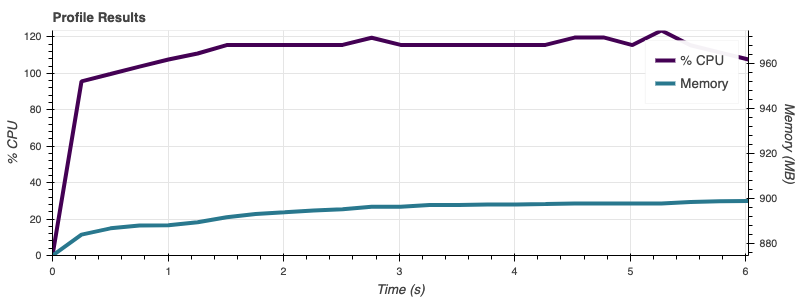

.. profile-8:

=============
Profiling
=============

Overview
--------
With Dask, you can profile the compute graph and also visualize the profiler output. The Bokeh extension for JupyterLab lets you render those visualization within your notebook. For more details, see `Dask Profiling <https://docs.dask.org/en/latest/diagnostics-local.html>`__.

ADS provides you a decorator that leverages the Dask profiler to help you visualize the CPU and memory utilization of supported operations.

How to Profile
---------------

Here is an example of how to profile the ``DatasetFactory.open`` operation:

.. code:: python3

    from ads.common.analyzer import resource_analyze
    from ads.dataset.factory import DatasetFactory

    @resource_analyze
    def fetch_data():
        ds = DatasetFactory.open("/home/datascience/ads-examples/oracle_data/orcl_attrition.csv", target="Attrition").set_positive_class('Yes')
        return ds

    ds = fetch_data()

A graph is rendered on the notebook:

