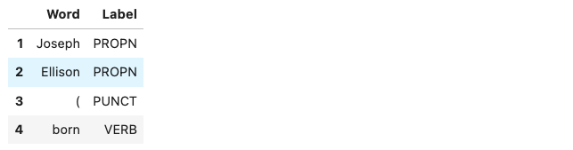
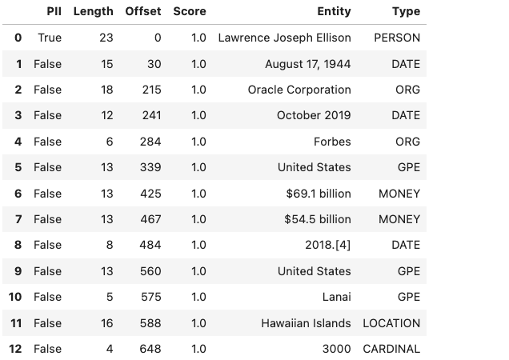
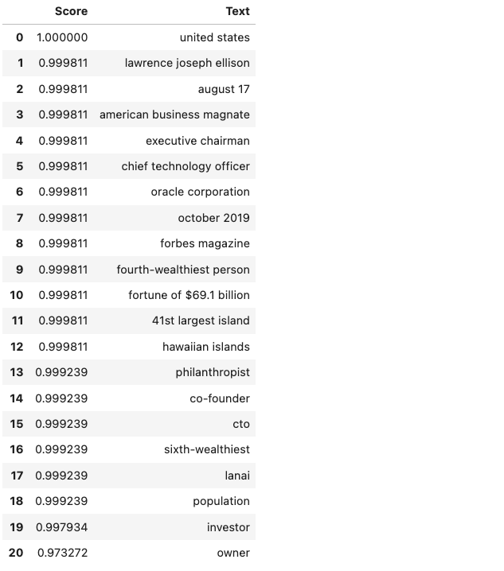

.. _adsstring-8:

=========
String
=========

Data scientists need to be able to quickly and easily manipulate
strings. The Accelerated Data Science (ADS) SDK provides an enhanced
string class, called ``ADSString``. It adds functionality like regular
expression (RegEx) matching and natural language processing (NLP)
parsing. The class can be expanded by registering custom plugins so that
you can process a string in a way that it fits your specific needs. For
example, you can register the OCI Language service plugin to bind
functionalities from the Language service to ``ADSString``.

.. code:: ipython3

    import ads
    import spacy
    
    from ads.feature_engineering.adsstring.oci_language import OCILanguage
    from ads.feature_engineering.adsstring.string import ADSString

Overview
--------

Text analytics uses a set of powerful tools to understand the content of
unstructured data, such as text. It’s becoming an increasingly more
important tool in feature engineering as product reviews, media content,
research papers, and more are being mined for their content. In many
data science areas, such as marketing analytics, the use of unstructured
text is becoming as popular as structured data. This is largely due to
the relatively low cost of collection of the data. However, the downside
is the complexity of working with the data. To work with unstructured
that you need to clean, summarize, and create features from it before
you create a model. The ``ADSString`` class provides tools that allow
you to quickly do this work. More importantly, you can expand the tool
to meet your specific needs.

Regular Expression Matching
---------------------------

Text documents are often parsed looking for specific patterns to extract
information like emails, dates, times, web links, and so on. This
pattern matching is often done using RegEx, which is hard to write,
modify, and understand. Custom written RegEx often misses the edge
cases. ``ADSString`` provides a number of common RegEx patterns so
that your work is simplified. You can use the following patterns:

-  ``credit_card``: Credit card number.
-  ``dates``: Dates in a variety of standard formats.
-  ``email``: Email address.
-  ``ip``: IP addresses, versions IPV4 and IPV6.
-  ``link``: Text that appears to be a link to a website.
-  ``phone_number_US``: USA phone numbers including those with
   extensions.
-  ``price``: Text that appears to be a price.
-  ``ssn``: USA social security number.
-  ``street_address``: Street address.
-  ``times``: Text that appears to be a time and less than 24 hours.
-  ``zip_code``: USA zip code.

The preceding ``ADSString`` properties return an array with each pattern
that in matches. The following examples demonstrate how to extract email
addresses, dates ,and links from the text. Note that the
text is extracted as is. For example, the dates aren't converted to a
standard format. The returned value is the text as it is represented in
the input text. Use the ``datetime.strptime()`` method to convert the
date to a date time stamp.

.. code:: ipython3

    s = ADSString("Get in touch with my associates john.smith@example.com and jane.johnson@example.com to schedule")
    s.email

.. parsed-literal::

    ['john.smith@example.com', 'jane.johnson@example.com']

.. code:: ipython3

    s = ADSString("She is born on Jan. 19th, 2014 and died 2021-09-10")
    s.date

.. parsed-literal::

    ['Jan. 19th, 2014', '2021-09-10']

.. code:: ipython3

    s = ADSString("Follow the link www.oracle.com to Oracle's homepage.")
    s.link

.. parsed-literal::

    ['www.oracle.com']

NLP Parsing
-----------

``ADSString`` also supports NLP parsing and is backed by
`Natural Language Toolkit (NLTK) <https://www.nltk.org/>`__ or `spaCy <https://spacy.io/>`__.
Unless otherwise specified, NLTK is used by default. You can extract
properties, such as nouns, adjectives, word counts, parts of speech
tags, and so on from text with NLP.

The ``ADSString`` class can have one backend enabled at a time. What
properties are available depends on the backend, as do the results of
calling the property. The following examples provide an overview of the
available parsers, and how to use them. Generally, the parser supports 
the ``adjective``, ``adverb``, ``bigram``, ``noun``, ``pos``,
``sentence``, ``trigram``, ``verb``, ``word``, and ``word_count`` base
properties. Parsers can support additional parsers.

Natural Language Toolkit Backend
~~~~~~~~~~~~~~~~~~~~~~~~~~~~~~~~

NLTK is a powerful platform for processing human language data. It 
supports all the base properties and in addition ``stem`` and 
``token``. The ``stem`` property returns a list of all the stemmed 
tokens. It reduces a token to its word stem that affixes to suffixes 
and prefixes, or to the roots of words that is the lemma. The 
``token`` property is similar to the ``word`` property, except it 
returns non-alphanumeric tokens and doesn’t force tokens to be
lowercase.

The following example use a sample of text about Larry Ellison to
demonstrate the use of the NLTK properties.

.. code:: ipython3

    test_text = """
                Lawrence Joseph Ellison (born August 17, 1944) is an American business magnate,
                investor, and philanthropist who is a co-founder, the executive chairman and
                chief technology officer (CTO) of Oracle Corporation. As of October 2019, he was
                listed by Forbes magazine as the fourth-wealthiest person in the United States
                and as the sixth-wealthiest in the world, with a fortune of $69.1 billion,
                increased from $54.5 billion in 2018.[4] He is also the owner of the 41st
                largest island in the United States, Lanai in the Hawaiian Islands with a
                population of just over 3000.
            """.strip()
    ADSString.nlp_backend("nltk")
    s = ADSString(test_text)

.. code:: ipython3

    s.noun[1:5]

.. parsed-literal::

    ['Joseph', 'Ellison', 'August', 'business']

.. code:: ipython3

    s.adjective

.. parsed-literal::

    ['American', 'chief', 'fourth-wealthiest', 'largest', 'Hawaiian']

.. code:: ipython3

    s.word[1:5]

.. parsed-literal::

    ['joseph', 'ellison', 'born', 'august']

By taking the difference between ``token`` and ``word``, the token set 
contains non-alphanumeric tokes, and also the uppercase version of words.

.. code:: ipython3

    list(set(s.token) - set(s.word))[1:5]

.. parsed-literal::

    ['Oracle', '1944', '41st', 'fourth-wealthiest']

The ``stem`` property takes the list of words and stems them. It
produces morphological variations of a word’s root form. The following
example stems some words, and shows some of the stemmed words that were
changed.

.. code:: ipython3

    list(set(s.stem) - set(s.word))[1:5]

.. parsed-literal::

    ['fortun', 'technolog', 'increas', 'popul']

Part of Speech Tags
*******************

Part of speech (POS) is a category in which a word is assigned based
on its syntactic function. POS depends on the language. For English,
the most common POS are adjective, adverb, conjunction, determiner,
interjection, noun, preposition, pronoun, and verb. However, each POS
system has its own set of POS tags that vary based on their respective
training set. The NLTK parsers produce the following POS tags:

-  ``CC``: coordinating conjunction
-  ``CD``: cardinal digit
-  ``DT``: determiner
-  ``EX``: existential there; like “there is” ; think of it like “there
           exists”
-  ``FW``: foreign word
-  ``IN``: preposition/subordinating conjunction
-  ``JJ``: adjective; “big”
-  ``JJR``: adjective, comparative; “bigger”
-  ``JJS``: adjective, superlative; “biggest”
-  ``LS``: list marker 1)
-  ``MD``: modal could, will
-  ``NN``: noun, singular; “desk”
-  ``NNS``: noun plural; “desks”
-  ``NNP``: proper noun, singular; “Harrison”
-  ``NNPS``: proper noun, plural; “Americans”
-  ``PDT``: predeterminer; “all the kids”
-  ``POS``: possessive ending; “parent’s”
-  ``PRP``: personal pronoun; I, he, she
-  ``PRP$``: possessive pronoun; my, his, hers
-  ``RB``: adverb; very, silently
-  ``RBR``: adverb; comparative better
-  ``RBS``: adverb; superlative best
-  ``RP``: particle; give up
-  ``TO``: to go; “to” the store.
-  ``UH``: interjection; errrrrrrrm
-  ``VB``: verb, base form; take
-  ``VBD``: verb, past tense; took
-  ``VBG``: verb, gerund/present participle; taking
-  ``VBN``: verb, past participle; taken
-  ``VBP``: verb, singular present; non-3d take
-  ``VBZ``: verb, 3rd person singular present; takes
-  ``WDT``: wh-determiner; which
-  ``WP``: wh-pronoun; who, what
-  ``WP$``: possessive wh-pronoun; whose
-  ``WRB``: wh-adverb; where, when

.. code:: ipython3

    s.pos[1:5]

.. image:: images/nltk_pos.png
    :alt: Listing of Part-of-Speech tags

spaCy
~~~~~

spaCy is in an advanced NLP toolkit. It helps you understand what the
words mean in context, and who is doing what to whom. It helps you
determine what companies and products are mentioned in a document. The
spaCy backend is used to parses the ``adjective``, ``adverb``,
``bigram``, ``noun``, ``pos``, ``sentence``, ``trigram``, ``verb``,
``word``, and ``word_count`` base properties. It also supports the
following additional properties:

-  ``entity``: All entities in the text.
-  ``entity_artwork``: The titles of books, songs, and so on.
-  ``entity_location``: Locations, facilities, and geopolitical entities,
                        such as countries, cities, and states.
-  ``entity_organization``: Companies, agencies, and institutions.
-  ``entity_person``: Fictional and real people.
-  ``entity_product``: Product names and so on.
-  ``lemmas``: A rule-based estimation of the roots of a word.
-  ``tokens``: The base tokens of the tokenization process. This is
               similar to ``word``, but it includes non-alphanumeric 
               values and the word case is preserved.

If the ``spacy`` module is installed ,you can change the
NLP backend using the ``ADSString.nlp_backend('spacy')`` command.

.. code:: ipython3

    ADSString.nlp_backend("spacy")
    s = ADSString(test_text)

.. code:: ipython3

    s.noun[1:5]

.. parsed-literal::

    ['magnate', 'investor', 'philanthropist', 'co']

.. code:: ipython3

    s.adjective

.. parsed-literal::

    ['American', 'executive', 'chief', 'fourth', 'wealthiest', 'largest']

.. code:: ipython3

    s.word[1:5]

.. parsed-literal::

    ['Joseph', 'Ellison', 'born', 'August']

You can identify all the locations that are mentioned in the text.

.. code:: ipython3

    s.entity_location

.. parsed-literal::

    ['the United States', 'the Hawaiian Islands']

Also, the organizations that were mentioned.

.. code:: ipython3

    s.entity_organization

.. parsed-literal::

    ['CTO', 'Oracle Corporation', 'Forbes', 'Lanai']

Part of Speech Tags
*******************

The POS tagger in spaCy uses a smaller number of categories. For
example, spaCy has the ``ADJ`` POS for all adjectives, while NLTK has
``JJ`` to mean an adjective. ``JJR`` refers to a comparative adjective,
and ``JJS`` refers to a superlative adjective. For fine grain analysis
of different parts of speech, NLTK is the preferred backend. However,
spaCy’s reduced category set tends to produce fewer errors,at the cost
of not being as specific.

The spaCy parsers produce the following POS tags:

-  ``ADJ``: adjective; big, old, green, incomprehensible, first
-  ``ADP``: adposition; in, to, during
-  ``ADV``: adverb; very, tomorrow, down, where, there
-  ``AUX``: auxiliary; is, has (done), will (do), should (do)
-  ``CONJ``: conjunction; and, or, but
-  ``CCONJ``: coordinating conjunction; and, or, but
-  ``DET``: determiner; a, an, the
-  ``INTJ``: interjection; psst, ouch, bravo, hello
-  ``NOUN``: noun; girl, cat, tree, air, beauty
-  ``NUM``: numeral; 1, 2017, one, seventy-seven, IV, MMXIV
-  ``PART``: particle; ’s, not,
-  ``PRON``: pronoun; I, you, he, she, myself, themselves, somebody
-  ``PROPN``: proper noun; Mary, John, London, NATO, HBO
-  ``PUNCT``: punctuation; ., (, ), ?
-  ``SCONJ``: subordinating conjunction; if, while, that
-  ``SYM``: symbol; $, %, §, ©, +, −, ×, ÷, =, :), 😝
-  ``VERB``: verb; run, runs, running, eat, ate, eating
-  ``X``: other; sfpksdpsxmsa
-  ``SPACE``: space

.. code:: ipython3

    s.pos[1:5]

Plugin
------

One of the most powerful features of ``ADSString`` is that you can 
expand and customize it. The ``.plugin_register()`` method allows you to
add properties to the ``ADSString`` class. These plugins can be provided
by third-party providers or developed by you. This section
demonstrates how to connect the to the Language service, and how to
create a custom plugin.

OCI Language Services
~~~~~~~~~~~~~~~~~~~~~

The `Language
service <https://docs.oracle.com/iaas/language/using/overview.htm>`__
provides pretrained models that provide sophisticated text analysis at
scale.

The Language service contains these pretrained language processing
capabilities:

-  ``Aspect-Based Sentiment Analysis``: Identifies aspects from the
   given text and classifies each into positive, negative, or neutral
   polarity.
-  ``Key Phrase Extraction``: Extracts an important set of phrases from
   a block of text.
-  ``Language Detection``: Detects languages based on the given text,
   and includes a confidence score.
-  ``Named Entity Recognition``: Identifies common entities, people,
   places, locations, email, and so on.
-  ``Text Classification``: Identifies the document category and
   subcategory that the text belongs to.

Those are accessible in ADS using the ``OCILanguage`` plugin.

.. code:: ipython3

    ADSString.plugin_register(OCILanguage)

Aspect-Based Sentiment Analysis
*******************************

Aspect-based sentiment analysis can be used to gauge the mood or the
tone of the text.

The aspect-based sentiment analysis (ABSA) supports fine-grained
sentiment analysis by extracting the individual aspects in the input
document. For example, a restaurant review “The driver was really
friendly, but the taxi was falling apart.” contains positive sentiment
toward the taxi driver aspect. Also, it has a strong negative sentiment
toward the service mechanical aspect of the taxi. Classifying the
overall sentiment as negative would neglect the fact that the taxi
driver was nice.

ABSA classifies each of the aspects into one of the three polarity
classes, positive, negative, mixed, and neutral. With the predicted
sentiment for each aspect. It also provides a confidence score for each
of the classes and their corresponding offsets in the input. The range
of the confidence score for each class is between 0 – 1, and the
cumulative scores of all the three classes sum to 1.

In the next example, the sample sentence is analyzed. The two aspects,
taxi cab and driver, have their sentiments determined. It defines the
location of the aspect by giving its offset position in the text, and
the length of the aspect in characters. It also gives the text that
defines the aspect along with the sentiment scores and which sentiment
is dominant.

.. code:: ipython3

    t = ADSString("The driver was really friendly, but the taxi was falling apart.")
    t.absa

.. image:: images/absa.png
    :alt: Results of Aspect-Based Sentiment analysis

Named Entity Recognition
************************

Named entity recognition (NER) detects named entities in text. The NER
model uses NLP, which uses machine learning to find predefined named
entities. This model also provides a confidence score for each entity and
is a value from 0 - 1. The returned data is the text of the entity, its
position in the document, and its length. It also identifies the type of
entity, a probability score that it is an entity of the stated type.

The following are the supported entity types:

-  ``DATE``: Absolute or relative dates, periods, and date range.
-  ``EMAIL``: Email address.
-  ``EVENT``: Named hurricanes, sports events, and so on.
-  ``FAC``: Facilities; Buildings, airports, highways, bridges, and so
             on.
-  ``GPE``: Geopolitical entity; Countries, cities, and states.
-  ``IPADDRESS``: IP address according to IPv4 and IPv6 standards.
-  ``LANGUAGE``: Any named language.
-  ``LOCATION``: Non-GPE locations, mountain ranges, and bodies of
                 water.
-  ``MONEY``: Monetary values, including the unit.
-  ``NORP``: Nationalities, religious, and political groups.
-  ``ORG``: Organization; Companies, agencies, institutions, and so on.
-  ``PERCENT``: Percentage.
-  ``PERSON``: People, including fictional characters.
-  ``PHONE_NUMBER``: Supported phone numbers.

   -  (“GB”) - United Kingdom
   -  (“AU”) - Australia
   -  (“NZ”) - New Zealand
   -  (“SG”) - Singapore
   -  (“IN”) - India
   -  (“US”) - United States

-  ``PRODUCT``: Vehicles, tools, foods, and so on (not services).
-  ``QUANTITY``: Measurements, as weight or distance.
-  ``TIME``: Anything less than 24 hours (time, duration, and so on).
-  ``URL``: URL

The following example lists the named entities in the “Lawrence Joseph
Ellison…” ``test_text``. The output gives the named entity, its
location, and offset position in the text. It also gives a probability and
score that this text is actually a named entity along with the type.

.. code:: ipython3

    s = ADSString(test_text)
    s.ner

Key Phrase Extraction
*********************

Key phrase (KP) extraction is the process of extracting the words with
the most relevance, and expressions from the input text. It helps
summarize the content and recognizes the main topics. The KP extraction
finds insights related to the main points of the text. It understands
the unstructured input text, and returns keywords and KPs. The KPs
consist of subjects and objects that are being talked about in the
document. Any modifiers, like adjectives associated with these subjects
and objects, are also included in the output. Confidence scores for each
key phrase that signify how confident the algorithm is that the
identified phrase is a KP. Confidence scores are a value from 0 - 1.

The following example determines the key phrases and the importance of
these phrases.

.. code:: ipython3

    s.key_phrase

Language Detection
******************

The language detection tool identifies which natural language the input
text is in. If the document contains more than one language, the results
may not be what you expect. Language detection can help make customer
support interactions more personable and quicker. Customer service
chatbots can interact with customers based on the language of their
input text and respond accordingly. If a customer needs help with a
product, the chatbot server can field the corresponding language product
manual, or transfer it to a call center for the specific language.

The following is a list of some of the supported languages:

-  Afrikaans
-  Albanian
-  Arabic
-  Armenian
-  Azerbaijani
-  Basque
-  Belarusian
-  Bengali
-  Bosnian
-  Bulgarian
-  Burmese
-  Cantonese
-  Catalan
-  Cebuano
-  Chinese
-  Croatian
-  Czech
-  Danish
-  Dutch
-  Eastern Punjabi
-  Egyptian Arabic
-  English
-  Esperanto
-  Estonian
-  Finnish
-  French
-  Georgian
-  German
-  Greek
-  Hebrew
-  Hindi
-  Hungarian
-  Icelandic
-  Indonesian
-  Irish
-  Italian
-  Japanese
-  Javanese
-  Kannada
-  Kazakh
-  Korean
-  Kurdish (Sorani)
-  Latin
-  Latvian
-  Lithuanian
-  Macedonian
-  Malay
-  Malayalam
-  Marathi
-  Minangkabau
-  Nepali
-  Norwegian (Bokmal)
-  Norwegian (Nynorsk)
-  Persian
-  Polish
-  Portuguese
-  Romanian
-  Russian
-  Serbian
-  Serbo-Croatian
-  Slovak
-  Slovene
-  Spanish
-  Swahili
-  Swedish
-  Tagalog
-  Tamil
-  Telugu
-  Thai
-  Turkish
-  Ukrainian
-  Urdu
-  Uzbek
-  Vietnamese
-  Welsh

The next example determines the language of the text, the `ISO
639-1 <https://en.wikipedia.org/wiki/ISO_639-1>`__ language code, and a
probability score.

.. code:: ipython3

    s.language_dominant

.. image:: images/language_dominant.png
    :alt: Results of language detection

Text Classification
*******************

Text classification analyses the text and identifies categories for the
content with a confidence score. Text classification uses NLP techniques
to find insights from textual data. It returns a category from a set of
predefined categories. This text classification uses NLP and relies on
the main objective lies on zero-shot learning. It classifies text with
no or minimal data to train. The content of a collection of documents is
analyzed to determine common themes.

The next example classifies the text and gives a probability score that the
text is in that category.

.. code:: ipython3

    s.text_classification

.. image:: images/text_classification.png
    :alt: Results of text classification analysis

Custom Plugin
~~~~~~~~~~~~~

You can bind additional properties to ``ADSString`` using custom
plugins. This allows you to create custom text processing extensions. A
plugin has access to the ``self.string`` property in ``ADSString``
class. You can define functions that perform a transformation on the
text in the object. All functions defined in a plugin are bound to
``ADSString`` and accessible across all objects of that class.

Assume that your text is
``"I purchased the gift on this card 4532640527811543 and the dinner on 340984902710890"``
and you want to know what credit cards were used. The ``.credit_card``
property returns the entire credit card number. However, for privacy
reasons you don’t what the entire credit card number, but the last four
digits.

To solve this problem, you can create the class ``CreditCardLast4`` and
use the ``self.string`` property in ``ADSString`` to access the text
associated with the object. It then calls the ``.credit_card`` method to
get the credit card numbers. Then it parses this to return the last four
characters in each credit card.

The first step is to define the class that you want to bind to
``ADSString``. Use the ``@property`` decorator and define a property
function. This function only takes ``self``. The ``self.string`` is
accessible with the text that is defined for a given object. The
property returns a list.

.. code:: ipython3

    class CreditCardLast4:    
        @property
        def credit_card_last_4(self):
            return [x[len(x)-4:len(x)] for x in ADSString(self.string).credit_card]

After the class is defined, it must be registered with ``ADSString``
using the ``.register_plugin()`` method.

.. code:: ipython3

    ADSString.plugin_register(CreditCardLast4)

Take the text and make it an ``ADSString`` object, and call the
``.credit_card_last_4`` property to obtain the last four digits of the
credit cards that were used.

.. code:: ipython3

    creditcard_numbers = "I purchased the gift on this card 4532640527811543 and the dinner on 340984902710890"
    s = ADSString(creditcard_numbers)
    s.credit_card_last_4

.. parsed-literal::

    ['1543', '0890']

``ADSString`` is Still a String
--------------------------------

While ``ADSString`` expands your feature engineering capabilities, it
can still be treated as a ``str`` object. Any standard operation on
``str`` is preserved in ``ADSString``. For instance, you can convert it
to lowercase:

.. code:: ipython3

    hello_world = "HELLO WORLD"
    s = ADSString(hello_world)
    s.lower()

.. parsed-literal::

    'hello world'

You could split a text string.

.. code:: ipython3

    s.split()

.. parsed-literal::

    ['HELLO', 'WORLD']

You can use all the ``str`` methods, such as the ``.replace()`` method,
to replace text.

.. code:: ipython3

    s.replace("L", "N")

.. parsed-literal::

    'HENNO WORND'

You can perform a number of ``str`` manipulation operations, such as
``.lower()`` and ``.upper()`` to get an ``ADSString`` object back.

.. code:: ipython3

    isinstance(s.lower().upper(), ADSString)

.. parsed-literal::

    True

While a new ``ADSString`` object is created with ``str`` manipulation
operations, the equality operation holds.

.. code:: ipython3

    s.lower().upper() == s

.. parsed-literal::

    True

The equality operation even holds between ``ADSString`` objects (``s``)
and ``str`` objects (``hello_world``).

.. code:: ipython3

    s == hello_world

.. parsed-literal::

    True

